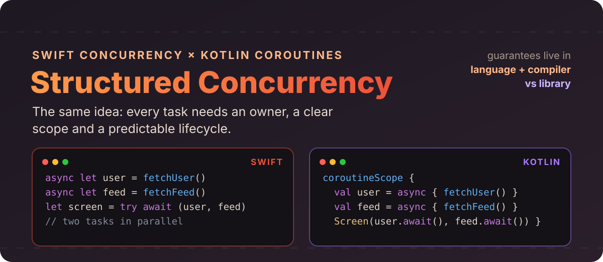
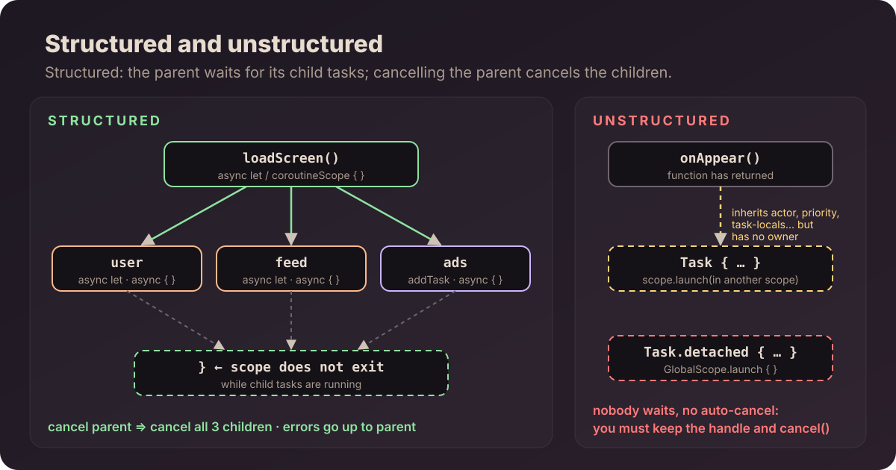
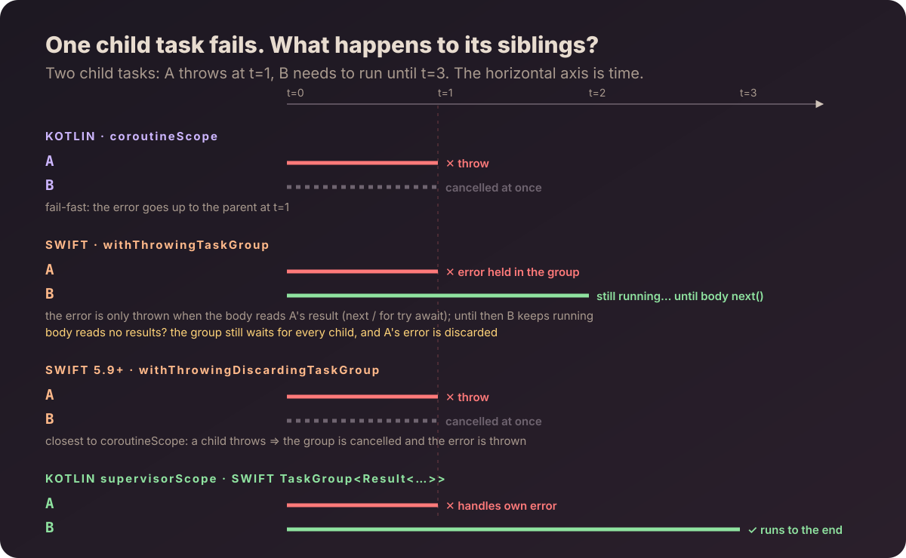
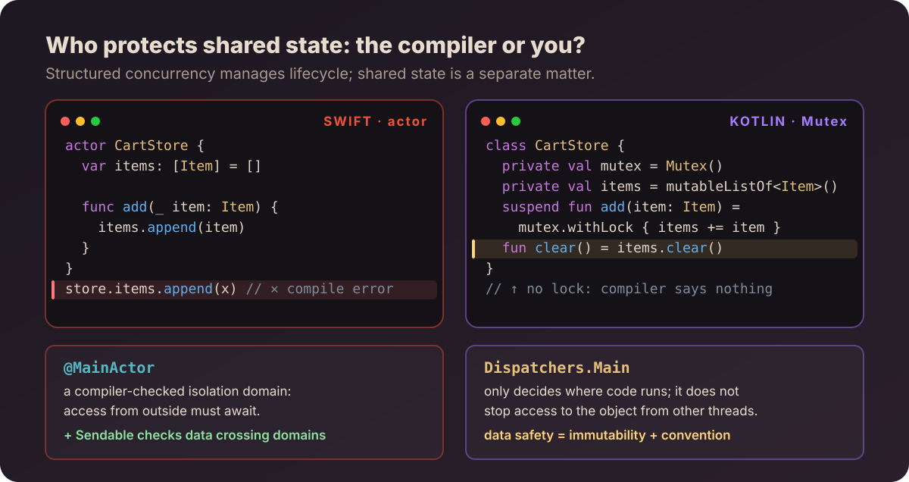
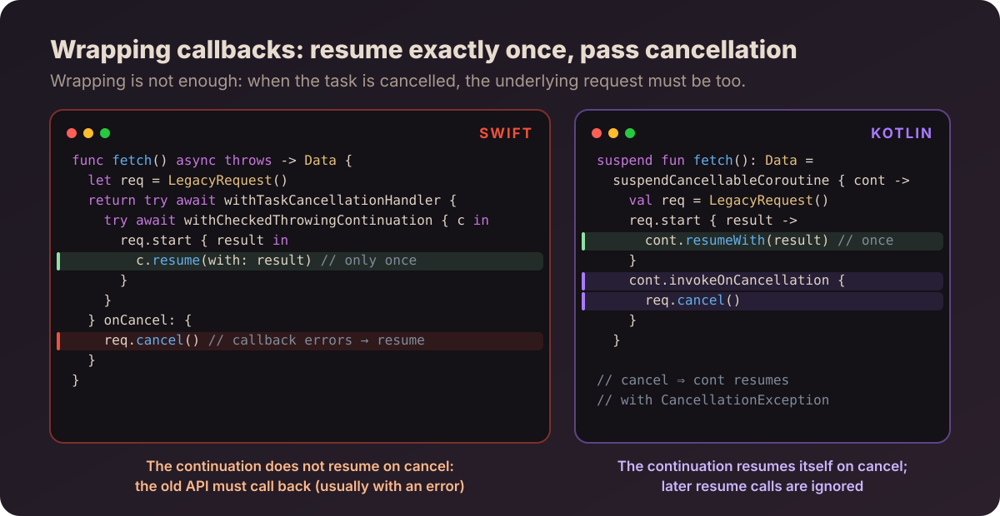

# Author : ChungHA

# Swift Concurrency vs Kotlin Coroutines: two takes on Structured Concurrency



Anyone who works on both iOS and Android has probably done this: you see `async let` in Swift and your head converts it to Kotlin's `async { }`, you see `Task { }` and think of `launch`, you see `actor` and assume it is like a `Mutex`. That 1-to-1 mapping works for a while, until you hit a cancelled task that never stops, an error that gets swallowed, or a data race that the other side's compiler would have reported at build time.


The conclusion of the whole article, up front:

> **The APIs look alike, but the guarantees live in different places.** Kotlin builds structured concurrency in a library: `CoroutineScope`, `Job`, `CoroutineContext`. Swift puts it into the language, compiler and runtime: `async let`, task groups, `actor`, `Sendable`.

The examples use Swift 6.x and a recent stable `kotlinx.coroutines`. Wherever I write "equivalent", read it as conceptually equivalent, not as two APIs with identical behavior.

## 1. The same problem

Running something asynchronously is not hard. The hard part is what happens afterwards: the work spawns more child tasks, one child task fails, the user leaves the screen, or nobody needs the result anymore. Without a clear structure, tasks run longer than they should, errors go uncaught, and cancellation has to be managed by hand.

Structured concurrency solves this by tying each task to the place that created it, following four rules:

1. every task belongs to a scope;
2. a scope only finishes when all of its child tasks are done;
3. cancellation and errors propagate by well-defined rules;
4. resources are released when the scope ends.

Swift and Kotlin both follow these four rules. The difference is how the task tree is built: Swift uses `async let` and task groups, while Kotlin represents the tree with `Job`s inside a `CoroutineScope`.

## 2. `async`/`await` and `suspend`: same mechanism, different syntax

This is the easiest pair to compare. The same function that loads a feed:

```swift
func loadFeed() async throws -> Feed {
    let user = try await api.user(token)
    let posts = try await api.posts(user)
    return Feed(user, posts)
}
```

```kotlin
suspend fun loadFeed(): Feed {
    val user = api.user(token)
    val posts = api.posts(user)
    return Feed(user, posts)
}
```


Underneath, both sides do the same thing: the compiler splits the function at its suspension points, stores the state in a **continuation** on the heap, and gives the thread back to do other work. I covered the Kotlin side in [Suspend Functions: The Heart of Coroutines](../../kotlin/suspend-compiler/) and the Swift side in [Swift Concurrency part 2](../../swift/swift-concurrency-part2/). Read both and you will see that Kotlin's state machine and Swift's way of splitting a function into pieces connected by continuations are almost identical.

The difference is **where the suspension point shows up in the code**:

- **Swift** requires every point to be marked with `await`. You can see at a glance which lines may let another task run. This matters a lot when working with actors (see reentrancy in section 10).
- **Kotlin** has no keyword at the call site. A line that looks like a regular function call can still suspend, so you have to know that function's signature (Android Studio shows a gutter icon as a reminder).

One thing both have in common: **marking a function `async` or `suspend` does not make its body non-blocking.** If it calls `Thread.sleep` or reads a file synchronously, the thread is still blocked as usual.

## 3. Creating a task does not make it structured

The most common misconception is that every modern concurrency API is structured. It is not.

In Swift, `Task { }` creates an **unstructured task**. It inherits priority, `@TaskLocal` values and actor isolation from where it was created, but its lifecycle is **not bounded** by the function that created it. The function returns and the task keeps running, and nothing cancels it automatically.

```swift
func onAppear() {
    loadTask = Task {
        try await viewModel.refresh()
    }
    // onAppear returns right away, loadTask keeps running
}
```

In Kotlin, `launch` and `async` are extensions on `CoroutineScope`, so you **cannot** call them without a scope. The new coroutine becomes a child of the `Job` in that scope:

```kotlin
class FeedViewModel : ViewModel() {
    fun onAppear() {
        viewModelScope.launch {
            repository.refresh()   // child of viewModelScope, cancelled when the ViewModel is cleared
        }
    }
}
```

In short: Kotlin forces you to pick an owner when you create the task. Swift lets you create a `Task` almost anywhere, and managing the owner (keeping the handle, cancelling at the right time) is your responsibility.



The handle types side by side:

| Swift | Kotlin | Notes |
|---|---|---|
| `Task<T, Error>` | `Deferred<T>` | a handle that returns a result |
| `Task<Void, Never>` | `Job` | a handle used only to observe or cancel |
| `try await task.value` | `deferred.await()` | get the result |
| `task.cancel()` | `job.cancel()` | *request* cancellation (cooperative) |
| `Task.detached { }` | `GlobalScope.launch { }` | inherits nothing, has no owner — almost always a code smell |

Keeping a reference to a task does **not** make it structured. Structure is a parent–child relationship and has nothing to do with whether you hold the handle.

## 4. Structured in Swift: `async let` and task groups

### `async let`: when the number of tasks is known up front

If you know at the time of writing how many things need to run in parallel, `async let` is the most compact way:

```swift
func loadScreen() async throws -> FeedScreen {
    async let user = api.user()
    async let posts = api.posts()
    async let banner = api.banner()

    return try await FeedScreen(user: user, posts: posts, banner: banner)
}
```

The three calls run in parallel and all three are **child tasks of `loadScreen`**. The equivalent in Kotlin is `coroutineScope` combined with `async`:

```kotlin
suspend fun loadScreen(): FeedScreen = coroutineScope {
    val user = async { api.user() }
    val posts = async { api.posts() }
    val banner = async { api.banner() }

    FeedScreen(user.await(), posts.await(), banner.await())
}
```

`coroutineScope` does not create a new thread and it is not a global scope. It is a suspend function that creates a child `Job` and only returns when every coroutine launched inside it has finished.

**A difference the original article does not mention:** what if you do *not* await a child task?

- Swift: an `async let` that has not been awaited before leaving the scope is **implicitly cancelled**, and then awaited. Not using the result means Swift assumes you no longer need it.
- Kotlin: an `async` that is never awaited still **runs to completion**, because `coroutineScope` only waits, it does not cancel.

```swift
async let analytics = sendAnalytics()
return try await api.user()
// on leaving the scope: analytics is cancelled, then awaited
```

```kotlin
coroutineScope {
    async { sendAnalytics() }   // nobody awaits it
    api.user()
} // coroutineScope still waits for sendAnalytics to finish
```

If you port a fire-and-forget snippet from Kotlin to Swift using `async let`, the analytics request is cancelled without any warning.

### Task groups: when the number of tasks is only known at runtime

When the number of tasks depends on runtime data, Swift uses `withTaskGroup` or `withThrowingTaskGroup`:

```swift
let thumbnails = await withTaskGroup(of: Thumbnail.self) { group in
    for photo in photos {
        group.addTask { await makeThumbnail(photo) }
    }
    var result: [Thumbnail] = []
    for await thumb in group {
        result.append(thumb)
    }
    return result
}
```

Kotlin has no object like `TaskGroup` in its core API. You create child coroutines inside `coroutineScope` and collect the results:

```kotlin
val thumbnails = coroutineScope {
    photos
        .map { photo -> async { makeThumbnail(photo) } }
        .awaitAll()
}
```

A small note: `for await` in Swift yields results in **completion order**, while `awaitAll()` preserves **input order**. If you need to keep the order on the Swift side, return the index as well (`(Int, Thumbnail)`) and sort afterwards.

| Swift | Kotlin |
|---|---|
| `async let` | `coroutineScope { async { } }` |
| `withTaskGroup` / `withThrowingTaskGroup` | `coroutineScope { list.map { async { } }.awaitAll() }` |
| `group.addTask { }` | `async { }` / `launch { }` inside the scope |
| `for await x in group` | `awaitAll()` (different ordering!) |
| `withDiscardingTaskGroup` | `coroutineScope { launch { } }` |

## 5. Lifecycle in the UI: who owns the task?

Structure is not only about waiting for results. It also defines which tasks must stop when their owner goes away. When a screen closes, a request that only serves that screen has to be cancelled too.

| SwiftUI | Jetpack Compose / Android |
|---|---|
| `.task { }` — cancelled when the view disappears | `LaunchedEffect(Unit) { }` — cancelled when leaving the composition |
| `.task(id: query) { }` — cancelled and restarted when `id` changes | `LaunchedEffect(query) { }` |
| a `Task` stored in an `@Observable` model, calling `cancel()` yourself | `viewModelScope.launch { }` — cancelled automatically in `onCleared()` |

None of these pairs match exactly: `viewModelScope` outlives a composition (on rotation, for example), while `.task` is tied to the view. What matters is **being able to answer who owns this task**, not finding an API with a similar name.

## 6. Cancellation: both are cooperative

On both sides, cancelling only **sends a request to stop**. It does not interrupt code immediately. Your code has to check for it:

```swift
for photo in photos {
    try Task.checkCancellation()     // throws CancellationError if the task was cancelled
    await upload(photo)
}
```

```kotlin
for (photo in photos) {
    currentCoroutineContext().ensureActive()   // throws CancellationException
    upload(photo)
}
```

`Task.sleep` and `delay` check for cancellation themselves, and so do many other standard APIs. But **passing through a suspension point does not mean cancellation was checked**. In a heavy computation loop or in code you wrote yourself, you have to add the checks.

### Cancel has no effect on code that does not cooperate

`job.cancel()` does one thing: it moves the `Job` into the cancelling state. It does not stop the thread and it does not interrupt the running code. The coroutine only stops when the code inside it **reads that state and exits on its own**. If nothing reads it, the coroutine runs to the end.

An example of a loop with no `delay` and no `isActive` check:

```kotlin
// ✕
val job = scope.launch(Dispatchers.Default) {
    var i = 0
    while (i < 5) {
        Thread.sleep(500)             // blocking, knows nothing about coroutines
        println("working ${i++}")
    }
}

delay(1_200)
println("cancel")
job.cancelAndJoin()
println("done")
```

```text
working 0
working 1
cancel
working 2
working 3
working 4
done
```

Cancel was called, but the remaining three iterations still run, and `cancelAndJoin()` has to wait until the loop ends by itself. If the condition were `while (true)`, this coroutine would never stop.

The `suspend` keyword does not add any check either. A `suspend` function that only contains computation still cannot be cancelled:

```kotlin
// ✕ marked suspend, but no suspension point checks for cancellation
suspend fun checksum(files: List<File>): List<String> =
    files.map { file -> sha256(file.readBytes()) }
```

The third case is harder to spot: the function really suspends, but it is written with `suspendCoroutine` instead of `suspendCancellableCoroutine`:

```kotlin
// ✕ suspendCoroutine knows nothing about cancellation
suspend fun download(url: String): ByteArray = suspendCoroutine { cont ->
    client.get(url) { bytes -> cont.resume(bytes) }
}

val job = scope.launch {
    val bytes = download(url)   // cancelled here: still waits until the callback returns
    cache.save(bytes)           // and still runs, because nothing throws
}
```

When cancelled, the coroutine stays suspended in `download` until the request finishes, the request is not aborted, and `cache.save` still runs afterwards.

The fix for each case:

```kotlin
// ✓ loop: check on every iteration
while (i < 5) {
    ensureActive()                          // or: while (isActive), or yield()
    ...
}

// ✓ computation: check between units of work
suspend fun checksum(files: List<File>): List<String> =
    files.map { file ->
        currentCoroutineContext().ensureActive()
        sha256(file.readBytes())
    }

// ✓ blocking code: runInterruptible interrupts the thread when the coroutine is cancelled
runInterruptible(Dispatchers.IO) { Thread.sleep(500) }

// ✓ callback: use suspendCancellableCoroutine and abort the request
suspend fun download(url: String): ByteArray = suspendCancellableCoroutine { cont ->
    val call = client.get(url) { bytes -> cont.resume(bytes) }
    cont.invokeOnCancellation { call.cancel() }
}
```

The three checks behave differently: `isActive` only returns a `Boolean`, so you decide how to exit; `ensureActive()` throws `CancellationException`; and `yield()` both checks and gives the thread to other coroutines.

Swift is the same. Awaiting an async function you wrote yourself does not check for cancellation, so the loop below runs to the end even though the task was cancelled:

```swift
// ✕
let task = Task {
    for file in files {
        await process(file)        // process does not check for cancellation
    }
}
task.cancel()                      // only sets the isCancelled flag to true

// ✓
for file in files {
    try Task.checkCancellation()   // or: guard !Task.isCancelled else { return }
    await process(file)
}
```

Both sides also share an anti-pattern: **catching the cancellation error with a generic `catch` and carrying on as if nothing happened**.

```kotlin
// ✕ swallows CancellationException too, the coroutine keeps running after being cancelled
val result = runCatching { repository.load() }

// ✓
try {
    repository.load()
} catch (e: CancellationException) {
    throw e
} catch (e: Exception) {
    showError(e)
}
```

### What happens if you do not rethrow?

The easy thing to get wrong: swallowing the cancellation error **does not un-cancel the task**. The cancelled state is still there (the `Job` is cancelling, `Task.isCancelled` is still `true`), only your code does not know it should stop. From that point on, every suspension point that checks for cancellation throws **immediately** each time it is called, while code that does not check runs as normal.

An example of a function that syncs many items:

```kotlin
// ✕
suspend fun syncAll(items: List<Item>) {
    for (item in items) {
        try {
            api.upload(item)              // cancelled → throws CancellationException
        } catch (e: Exception) {          // catches CancellationException as well
            Log.e("Sync", "upload failed", e)
        }
    }
    prefs.edit().putLong("lastSync", now()).apply()   // still runs!
}
```

The user leaves the screen while item 3 of 100 is uploading. What happens, in order:

1. `upload(item3)` throws `CancellationException`, which the `catch` swallows and logs as if it were a network error.
2. The loop continues. The remaining 97 `upload` calls all throw immediately, adding 97 more "upload failed" lines to the log.
3. After the loop, `lastSync` is still written because it is regular code that does not check for cancellation. The app records **a completed sync while 98 items were never uploaded**.
4. During all of this, anyone who called `job.cancelAndJoin()`, or a parent waiting in `coroutineScope`, has to wait for this function to run to the end. The same goes for `withTimeout`: the time is up, but it does not return until the block stops.

With a retry or polling loop it is worse, because there is no end:

```kotlin
// ✕ after cancellation: delay() throws right away, catch swallows it, repeat → the loop spins and never stops
while (true) {
    try {
        refresh()
        delay(5_000)
    } catch (e: Exception) {
        Log.e("Poll", "retry", e)
    }
}
```

`delay` no longer waits 5 seconds. It throws right away, so the loop spins continuously, burns CPU, and the coroutine never finishes.

Swift has exactly the same problem, usually through `try?`:

```swift
// ✕ view disappears → Task.sleep throws right away, try? swallows it → the loop calls refresh() non-stop
.task {
    while true {
        await viewModel.refresh()
        try? await Task.sleep(for: .seconds(5))
    }
}

// ✓ let the error leave the loop
.task {
    do {
        while true {
            await viewModel.refresh()
            try await Task.sleep(for: .seconds(5))
        }
    } catch {
        // the task was cancelled, it ends here
    }
}
```

On the Kotlin side, if you still want to catch a generic `Exception`, check for cancellation again inside the `catch`:

```kotlin
// ✓
} catch (e: Exception) {
    currentCoroutineContext().ensureActive()   // if cancelled, rethrow instead of handling it as a regular error
    Log.e("Sync", "upload failed", e)
}
```

To sum up, not rethrowing does not cause a crash. It causes bugs that are harder to see: the task keeps running after its owner is gone, the log fills up with fake errors, wrong data gets written, and whoever called cancel waits far longer than expected.

Swift has one more trap of its own: when a `URLSession` request is cancelled, it throws **`URLError(.cancelled)`**, not `CancellationError`. If you only `catch is CancellationError` you will miss it, and the app shows a "Network error" message just because the user left the screen. The most reliable way is to check `Task.isCancelled` in the `catch` branch.

## 7. Error propagation: where the comparison stops working

This is where the 1-to-1 mapping is most dangerous.

**Kotlin:** in `coroutineScope`, when one child fails, **the scope and all siblings are cancelled immediately**, and then the error is passed up to the parent:

```kotlin
coroutineScope {
    launch { syncContacts() }
    launch { syncMessages() }   // cancelled as soon as syncContacts throws
}
```

**Swift:** in `withThrowingTaskGroup`, a child's error is **held inside the group** until the body reads it through `next()` or `for try await`. The group only cancels the remaining children once the error is thrown out of the body:

```swift
try await withThrowingTaskGroup(of: Void.self) { group in
    group.addTask { try await syncContacts() }
    group.addTask { try await syncMessages() }

    for try await _ in group { }   // the error of whichever child finishes first is thrown here
}
```

Watch out for `group.waitForAll()` too: it waits for **all** children to finish and then throws the first error, without cancelling any child along the way, so an error does not stop the siblings early.

And the biggest trap: **if the body does not read any result**, the group still waits for every child at the end of the block, but **the children's errors are discarded**. The code looks exactly like the Kotlin version, but the error is gone.

Swift 5.9 added `withThrowingDiscardingTaskGroup`, and this is what is actually **closest to `coroutineScope`**: children return no result, and as soon as one child throws, the group is cancelled and the error is thrown.

```swift
try await withThrowingDiscardingTaskGroup { group in
    group.addTask { try await syncContacts() }
    group.addTask { try await syncMessages() }   // cancelled if syncContacts fails
}
```



In short: do not assume `withThrowingTaskGroup` is equivalent to `coroutineScope`. Both create structured child tasks, but **how errors are detected and propagated is different**.

## 8. Supervision: built into Kotlin, do-it-yourself in Swift

Not every group of tasks should stop everything when one task fails. Refreshing recommendations and refreshing notifications are independent, and there is no reason for one to stop because the other failed.

Kotlin has a built-in mechanism for this: `supervisorScope` (or `SupervisorJob`):

```kotlin
supervisorScope {
    launch {
        try {
            refreshRecommendations()
        } catch (e: CancellationException) {
            throw e
        } catch (e: Exception) {
            logger.report(e)
        }
    }
    launch { /* refreshNotifications(), same error handling */ }
}
```

When children are independent, **each child has to handle its own errors**. In `supervisorScope`, if a `launch` lets an error escape, the error goes to the `CoroutineExceptionHandler`; without a handler, the app crashes on Android. `async`, on the other hand, keeps the error in the `Deferred` until `await()` is called.

Swift has no supervisor as a first-class concept. The approach is to **turn the error into a value** inside each child:

```swift
await withTaskGroup(of: Result<Void, Error>.self) { group in
    group.addTask {
        do { try await refreshRecommendations(); return .success(()) }
        catch { return .failure(error) }
    }
    group.addTask {
        do { try await refreshNotifications(); return .success(()) }
        catch { return .failure(error) }
    }
    for await result in group {
        if case .failure(let error) = result { logger.report(error) }
    }
}
```

According to the original article, Swift 6.4 adds an async `Result { try await … }` initializer, which makes the `do/catch` above much shorter; on older versions, write it as shown. Either way, you should **decide explicitly** whether `CancellationError` is a regular `.failure` or a cancellation signal that has to be respected.

This is a design difference: Kotlin puts the supervision policy **into the `Job` tree**, while Swift leaves it **in how you model and handle results**.

## 9. Executors and Dispatchers: where does the code run?

Both separate a task from the thread that executes it, but they expose this differently.

| Kotlin | Swift | Notes |
|---|---|---|
| `Dispatchers.Default` | global concurrent executor (cooperative thread pool) | thread count roughly equals core count |
| `Dispatchers.Main` | `@MainActor` | *not* equivalent, see section 10 |
| `Dispatchers.IO` | — | Swift has no separate thread pool for blocking I/O |
| `withContext(ctx) { }` | calling another actor's function / `@concurrent` | change where code executes |
| `limitedParallelism(n)` | custom executor | limit resources |

Kotlin puts the dispatcher in the `CoroutineContext`, and switching where code executes is written explicitly:

```kotlin
val bytes = withContext(Dispatchers.IO) {
    file.readBytes()   // blocking I/O, runs on the thread pool dedicated to I/O
}
```

Swift encourages you to think in terms of **isolation** first: code that belongs to an actor runs on that actor's executor, and after each `await` the task may continue on a different thread. Since Swift 6.2, with *approachable concurrency* enabled, a `nonisolated async` function runs on the **caller's** actor by default (`nonisolated(nonsending)`). To move heavy work to the thread pool, mark it `@concurrent`:

```swift
@concurrent
func decode(_ data: Data) async throws -> [Post] {
    try JSONDecoder().decode([Post].self, from: data)   // runs on the thread pool, does not occupy the main actor
}
```

The lack of `Dispatchers.IO` is where Android developers often run into trouble when moving to Swift. The cooperative thread pool has only about one thread per core, so blocking it with synchronous I/O stalls the whole app (I explained this in detail in [part 2](../../swift/swift-concurrency-part2/)). For work that really blocks, run it on a separate `DispatchQueue` and wrap it with a continuation.

Swift also has **task priority**, with inheritance and priority escalation: if a high-priority task is waiting on a low-priority task, the low-priority task is raised. Kotlin has no such concept. Choosing a dispatcher or limiting parallelism only changes the *execution resources*, not the *priority* of a task.

## 10. Isolation: `actor` vs synchronization primitives

Structured concurrency manages the **lifecycle** of tasks. It does not make **shared state** safe by itself.



Swift builds actors into the language:

```swift
actor CartStore {
    var items: [Item] = []

    func add(_ item: Item) {
        items.append(item)
    }
}

await store.add(item)        // ✓ calls from outside the actor must await
store.items.append(item)     // ✕ compile error: actor-isolated
```

Kotlin has no language-level actor, so similar behavior is built from library primitives:

```kotlin
class CartStore {
    private val mutex = Mutex()
    private val items = mutableListOf<Item>()

    suspend fun add(item: Item) = mutex.withLock { items += item }
}
```

Depending on the case, the Kotlin side also has:

- `MutableStateFlow.update { }` for observable state with atomic updates;
- a coroutine receiving messages from a `Channel` — the actor pattern in its literal sense;
- atomics for small state changes;
- thread confinement with a single-threaded dispatcher (`limitedParallelism(1)`) when the design allows it.

**Two differences that are easy to miss when treating `actor` as a `Mutex`:**

1. **Reentrancy is the opposite.** A Swift actor is *reentrant*: at every `await` inside a method, the actor lets other jobs run in between. Kotlin's `Mutex.withLock` *holds the lock across every suspension point* inside the block, so the whole block runs sequentially, even while waiting on the network. "Check, then update" logic is safe inside `withLock` but can race inside an actor if there is an `await` in the middle.
2. **`Mutex` is not reentrant.** Nesting `withLock` on the same mutex causes a deadlock. An actor calling its own methods has no such problem.

Also, **`@MainActor` is not equivalent to `Dispatchers.Main`**. `@MainActor` is an isolation domain checked by the compiler: code outside the domain that accesses it gets a compile error. `Dispatchers.Main` only decides *where* a coroutine runs. It does not prevent other code from accessing the same object from another thread.

## 11. `Sendable`: nothing equivalent on the Kotlin side

Swift 6 adds another layer of checking: data that **crosses the boundary between isolation domains** has to be safe. `Sendable` states that a value can be passed between domains, and the compiler verifies it.

Kotlin Coroutines has no comparable compiler-level guarantee. Safety depends on design decisions:

- prefer immutable models (`data class` with `val`, `ImmutableList`);
- do not expose mutable collections;
- protect changes with a mutex, atomics or thread confinement;
- expose `StateFlow`, keep `MutableStateFlow` private;
- document the intended scope of use for each component.

This is the core difference: **Kotlin organizes execution with the `Job` tree; Swift organizes execution and also checks part of data isolation at compile time.**

## 12. Streams: `AsyncSequence` and `Flow`

The same rules apply to streams, meaning multiple values delivered over time. For example, wrapping a listener-style API:

```swift
func locationUpdates() -> AsyncStream<Location> {
    AsyncStream { continuation in
        let token = locationManager.observe { continuation.yield($0) }
        continuation.onTermination = { _ in
            locationManager.remove(token)
        }
    }
}
```

```kotlin
fun locationUpdates(): Flow<Location> = callbackFlow {
    val token = locationManager.observe { trySend(it) }
    awaitClose { locationManager.remove(token) }
}
```

Both express the same idea: when the receiver is gone (the task is cancelled, the collector is cancelled), the listener has to be removed. In Kotlin, forgetting `awaitClose` makes `callbackFlow` throw an exception; in Swift, forgetting `onTermination` reports nothing at all, and the listener leaks.

Kotlin has a much richer stream ecosystem: `StateFlow`, `SharedFlow`, all kinds of operators for combining and transforming, sharing strategies, and `flowOn` to change context. Swift only covers basic asynchronous iteration with `AsyncSequence`; more complex reactive cases usually need Combine, the `swift-async-algorithms` package, or `Observations` (Swift 6.2) for `@Observable` models.

## 13. Continuations: wrapping old APIs while staying structured

Both let you turn a callback into an async/suspend function, with the same mandatory rule: **the continuation must be resumed exactly once.** But wrapping the callback is not enough. To keep structured concurrency, **the task's cancellation has to be passed down to the underlying request**.



The difference is in the details:

- **Kotlin** `suspendCancellableCoroutine`: when the coroutine is cancelled, the continuation **resumes by itself** with `CancellationException` immediately; any later `resume` call is ignored. `invokeOnCancellation` is where you cancel the request.
- **Swift** `withCheckedThrowingContinuation` **knows nothing about cancellation**. You have to wrap it in `withTaskCancellationHandler`, call `req.cancel()` in `onCancel`, and then rely on the old API calling the callback (usually with an error) so that the continuation is resumed. If the old API does not call the callback when cancelled, the task hangs forever. One more thing to note: if the task was *already* cancelled, `onCancel` runs **immediately, even before** `req.start`, so the old API has to handle being cancelled before it starts.

## 14. Matching anti-patterns

What these anti-patterns have in common: once you bypass structured concurrency, you lose the ability to track a task's lifecycle.

| Swift | Kotlin | Consequence |
|---|---|---|
| Using `Task.detached { }` as a shortcut | `GlobalScope.launch { }` | no owner, nobody cancels it, nobody sees the error |
| Calling `Task { }` all over a view without keeping the handle | `CoroutineScope(Dispatchers.IO).launch { }` creating a new scope each time | leaks, the task keeps running after the screen is closed |
| `catch { }` swallowing `CancellationError` | `runCatching { }` / `catch (e: Throwable)` | the task keeps running after being cancelled |
| `DispatchSemaphore.wait()` in async code | `runBlocking` inside a coroutine | blocks a pool thread, can deadlock |
| `withThrowingTaskGroup` without reading results | — | the children's errors are lost |
| — | `launch(Job()) { }` | cuts the parent–child relationship yourself |

## 15. How to think when moving between the two

When porting code from one side to the other, do not try to find a 1-to-1 API. Answer these six questions instead:

1. **Who owns the task?** In Kotlin: which `CoroutineScope`? In Swift: is this a structured child task, an unstructured `Task`, or a detached task?
2. **When must the task end?** Tie it to the scope of a function, a screen, a ViewModel, an actor or a service.
3. **How is cancellation passed along?** Which suspension points check for cancellation, and which heavy computations need their own checks?
4. **Which error policy does the group of tasks need?** Fail-fast, supervision, or independent results?
5. **What protects shared state?** A task tree does not replace actors, locks, atomics or immutability.
6. **Where does the code run, and where is it isolated?** Do not confuse an executor/dispatcher with a data-safety guarantee.

## Conclusion

Swift Concurrency and Kotlin Coroutines share the same core principle: concurrent tasks have to form a clear structure, and their lifecycle is decided by their owner.

Kotlin expresses that structure through `CoroutineScope`, `Job`, `coroutineScope` and `supervisorScope`: flexible, with the policies for error propagation, supervision and context all written out explicitly. Swift pushes the model deep into the language: `async let`, task groups, actors and `Sendable` let the compiler take part not only in organizing tasks but also in isolating state between domains.

That is why `Task` is not simply `launch`, `actor` is not just a `Mutex`, and `@MainActor` is not the same as choosing `Dispatchers.Main`. Understanding **where the guarantees live** is worth far more than memorizing an equivalence table.

## References

- [Concurrency — The Swift Programming Language](https://docs.swift.org/swift-book/documentation/the-swift-programming-language/concurrency/)
- [SE-0304: Structured Concurrency](https://github.com/swiftlang/swift-evolution/blob/main/proposals/0304-structured-concurrency.md)
- [SE-0317: async let bindings](https://github.com/swiftlang/swift-evolution/blob/main/proposals/0317-async-let.md)
- [SE-0381: DiscardingTaskGroups](https://github.com/swiftlang/swift-evolution/blob/main/proposals/0381-task-group-discard-results.md)
- [SE-0461: Run nonisolated async functions on the caller's actor by default](https://github.com/swiftlang/swift-evolution/blob/main/proposals/0461-async-function-isolation.md)
- [Coroutines basics — Kotlin Documentation](https://kotlinlang.org/docs/coroutines-basics.html)
- [Coroutine exceptions handling — Kotlin Documentation](https://kotlinlang.org/docs/exception-handling.html)
