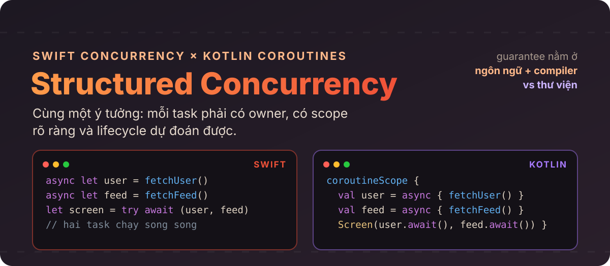
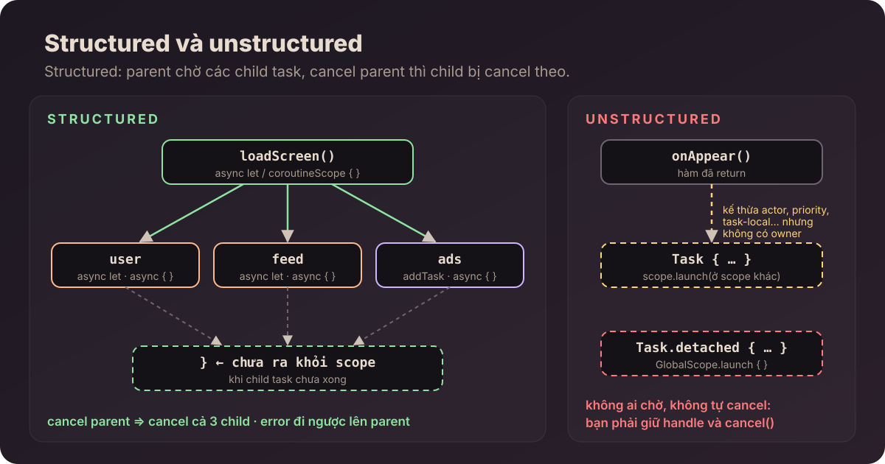
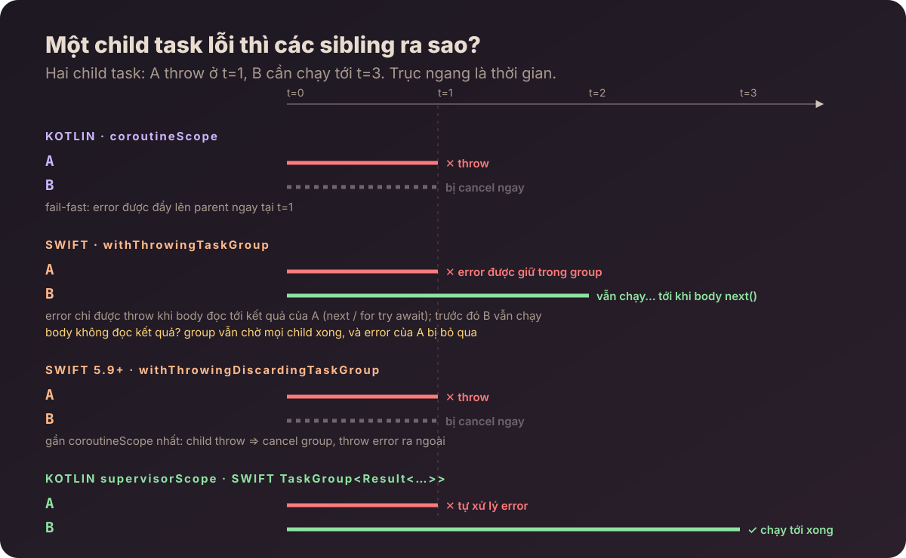
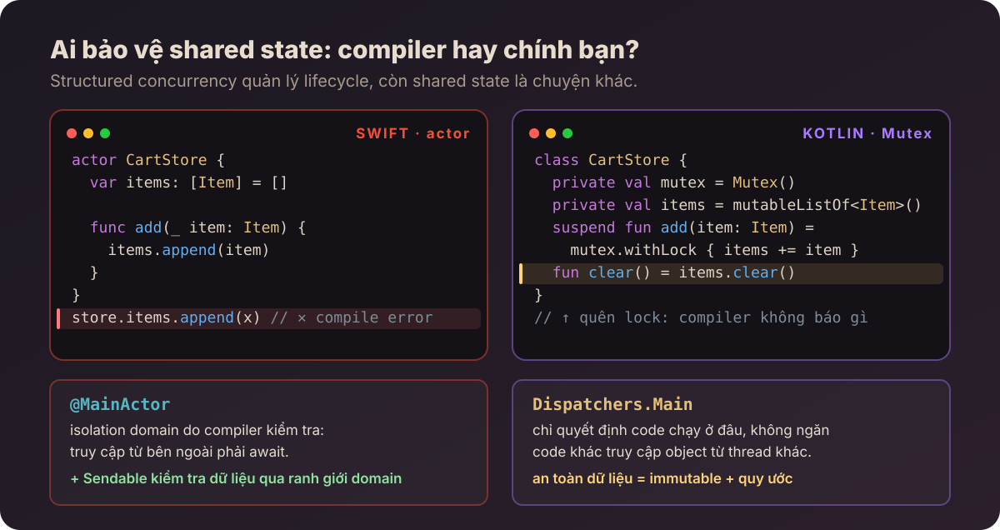
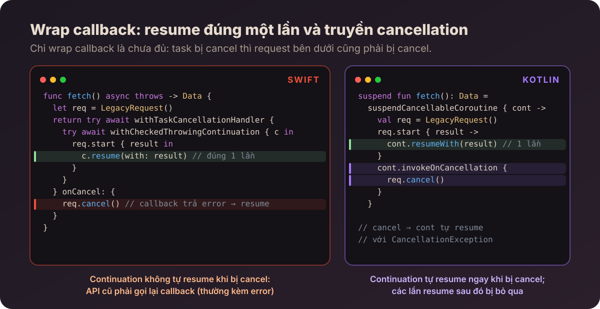

# Tác giả : ChungHA

# Swift Concurrency vs Kotlin Coroutines: hai cách làm Structured Concurrency



Ai làm cả iOS lẫn Android chắc đều từng như vậy: thấy `async let` trong Swift là trong đầu tự đổi sang `async { }` của Kotlin, thấy `Task { }` thì nghĩ ngay tới `launch`, thấy `actor` thì cho rằng nó giống `Mutex`. Cách map 1-1 như thế dùng được một thời gian, cho tới khi gặp một task cancel mãi không dừng, một error bị nuốt mất, hoặc một data race mà compiler bên kia lẽ ra đã báo từ lúc build.


Kết luận của cả bài, mình đưa lên trước:

> **API hai bên nhìn giống nhau, nhưng guarantee nằm ở chỗ khác nhau.** Kotlin xây structured concurrency bằng thư viện: `CoroutineScope`, `Job`, `CoroutineContext`. Swift đưa nó vào ngôn ngữ, compiler và runtime: `async let`, task group, `actor`, `Sendable`.

Ví dụ trong bài dùng Swift 6.x và `kotlinx.coroutines` bản stable gần đây. Những chỗ mình ghi là "tương đương" chỉ nên hiểu là tương đương về mặt khái niệm, không phải hai API có hành vi y hệt nhau.

## 1. Cùng một bài toán

Chạy một việc bất đồng bộ thì không khó. Cái khó nằm ở những gì xảy ra sau đó: việc này sinh thêm child task, một child task bị lỗi, user rời màn hình, hoặc kết quả không còn ai cần nữa. Nếu không có cấu trúc rõ ràng, task sẽ chạy lâu hơn mức cần thiết, error không ai bắt, còn cancellation thì phải tự quản lý bằng tay.

Structured concurrency giải quyết chuyện này bằng cách gắn mỗi task vào nơi đã tạo ra nó, theo bốn nguyên tắc:

1. mỗi task thuộc về một scope;
2. scope chỉ kết thúc khi tất cả child task đã xong;
3. cancellation và error được lan truyền theo quy tắc rõ ràng;
4. tài nguyên được giải phóng khi scope kết thúc.

Swift và Kotlin cùng theo bốn nguyên tắc này. Điểm khác là cách dựng cây task: Swift dùng `async let` và task group, còn Kotlin biểu diễn cây đó bằng `Job` bên trong một `CoroutineScope`.

## 2. `async`/`await` và `suspend`: cùng cơ chế, khác cách viết

Đây là cặp dễ so sánh nhất. Cùng một hàm load feed:

```swift
func loadFeed() async throws -> Feed {
    let user = try await api.user(token)
    let posts = try await api.posts(user)
    return Feed(user, posts)
}
```

```kotlin
suspend fun loadFeed(): Feed {
    val user = api.user(token)
    val posts = api.posts(user)
    return Feed(user, posts)
}
```


Bên dưới, hai bên làm cùng một việc: compiler tách hàm tại các suspension point, lưu state vào một **continuation** trên heap, rồi trả thread lại để làm việc khác. Mình đã phân tích phía Kotlin trong bài [Suspend Function trung tâm trong Coroutine](../../kotlin/suspend-compiler/) và phía Swift trong [Swift Concurrency phần 2](../../swift/swift-concurrency-part2/). Đọc cả hai sẽ thấy state machine của Kotlin và cách Swift chia hàm thành các đoạn nối bằng continuation gần như giống hệt nhau.

Khác biệt nằm ở **chỗ suspension point được thể hiện trong code**:

- **Swift** bắt buộc đánh dấu từng điểm bằng `await`. Nhìn vào là biết dòng nào có thể nhường cho task khác chạy. Điều này rất quan trọng khi làm việc với actor (xem phần reentrancy ở mục 10).
- **Kotlin** không có từ khoá nào ở chỗ gọi. Một dòng trông như gọi hàm bình thường vẫn có thể suspend, nên bạn phải biết signature của hàm đó (Android Studio có hiện icon ở lề để nhắc).

Một điểm chung cần nhớ: **đánh dấu `async` hay `suspend` không làm cho phần thân hàm trở thành non-blocking.** Nếu bên trong gọi `Thread.sleep` hay đọc file đồng bộ thì thread vẫn bị block như thường.

## 3. Tạo task không đồng nghĩa với structured

Nhầm lẫn hay gặp nhất là nghĩ rằng API concurrency hiện đại nào cũng là structured. Thực tế không phải vậy.

Trong Swift, `Task { }` tạo ra một **unstructured task**. Nó kế thừa priority, giá trị `@TaskLocal` và actor isolation từ nơi tạo ra nó, nhưng lifecycle của nó **không bị giới hạn** trong hàm đã tạo. Hàm return rồi task vẫn tiếp tục chạy, và không có gì tự động cancel nó.

```swift
func onAppear() {
    loadTask = Task {
        try await viewModel.refresh()
    }
    // onAppear return ngay, còn loadTask vẫn chạy
}
```

Trong Kotlin, `launch` và `async` là extension của `CoroutineScope`, nên **không thể** gọi chúng nếu không có scope. Coroutine mới sẽ là child của `Job` trong scope đó:

```kotlin
class FeedViewModel : ViewModel() {
    fun onAppear() {
        viewModelScope.launch {
            repository.refresh()   // child của viewModelScope, bị cancel khi ViewModel bị clear
        }
    }
}
```

Nói ngắn gọn: Kotlin buộc bạn chọn owner ngay lúc tạo task. Swift cho phép tạo `Task` ở gần như mọi nơi, và việc quản lý owner (giữ handle, cancel đúng lúc) là trách nhiệm của bạn.



Bảng so sánh các loại handle:

| Swift | Kotlin | Ghi chú |
|---|---|---|
| `Task<T, Error>` | `Deferred<T>` | handle có trả về kết quả |
| `Task<Void, Never>` | `Job` | handle chỉ dùng để theo dõi hoặc cancel |
| `try await task.value` | `deferred.await()` | lấy kết quả |
| `task.cancel()` | `job.cancel()` | *yêu cầu* cancel (cooperative) |
| `Task.detached { }` | `GlobalScope.launch { }` | không kế thừa gì, không có owner — gần như luôn là code smell |

Giữ reference tới một task **không** biến nó thành structured. Structured là quan hệ parent–child, không liên quan tới việc bạn có giữ handle hay không.

## 4. Structured trong Swift: `async let` và task group

### `async let`: khi biết trước số lượng task

Nếu lúc viết code đã biết có bao nhiêu việc cần chạy song song, `async let` là cách gọn nhất:

```swift
func loadScreen() async throws -> FeedScreen {
    async let user = api.user()
    async let posts = api.posts()
    async let banner = api.banner()

    return try await FeedScreen(user: user, posts: posts, banner: banner)
}
```

Ba lời gọi chạy song song và cả ba đều là **child task của `loadScreen`**. Cách viết tương đương trong Kotlin là `coroutineScope` kết hợp `async`:

```kotlin
suspend fun loadScreen(): FeedScreen = coroutineScope {
    val user = async { api.user() }
    val posts = async { api.posts() }
    val banner = async { api.banner() }

    FeedScreen(user.await(), posts.await(), banner.await())
}
```

`coroutineScope` không tạo thread mới và cũng không phải global scope. Nó là một suspend function tạo ra một `Job` con, và chỉ return khi mọi coroutine được launch bên trong đã chạy xong.

**Một khác biệt bài gốc không nhắc tới:** nếu bạn *không* await một child task thì sao?

- Swift: `async let` không được await trước khi ra khỏi scope sẽ bị **cancel ngầm**, sau đó mới được chờ. Không dùng tới kết quả nghĩa là Swift hiểu bạn không cần nó nữa.
- Kotlin: `async` không được await vẫn **chạy tới khi xong**, vì `coroutineScope` chỉ chờ chứ không cancel.

```swift
async let analytics = sendAnalytics()
return try await api.user()
// khi ra khỏi scope: analytics bị cancel rồi mới được chờ
```

```kotlin
coroutineScope {
    async { sendAnalytics() }   // không ai await
    api.user()
} // coroutineScope vẫn chờ sendAnalytics chạy xong
```

Nếu port một đoạn fire-and-forget từ Kotlin sang Swift bằng `async let`, request analytics sẽ bị cancel mà không có warning nào.

### Task group: khi số lượng task chỉ biết lúc runtime

Khi số lượng task phụ thuộc vào dữ liệu lúc chạy, Swift dùng `withTaskGroup` hoặc `withThrowingTaskGroup`:

```swift
let thumbnails = await withTaskGroup(of: Thumbnail.self) { group in
    for photo in photos {
        group.addTask { await makeThumbnail(photo) }
    }
    var result: [Thumbnail] = []
    for await thumb in group {
        result.append(thumb)
    }
    return result
}
```

Kotlin không có object nào giống `TaskGroup` trong core API. Bạn tạo các child coroutine trong `coroutineScope` rồi gom kết quả lại:

```kotlin
val thumbnails = coroutineScope {
    photos
        .map { photo -> async { makeThumbnail(photo) } }
        .awaitAll()
}
```

Một lưu ý nhỏ: `for await` trong Swift trả kết quả theo **thứ tự hoàn thành**, còn `awaitAll()` giữ nguyên **thứ tự đầu vào**. Nếu cần giữ thứ tự ở phía Swift, hãy trả kèm index (`(Int, Thumbnail)`) rồi sắp xếp lại.

| Swift | Kotlin |
|---|---|
| `async let` | `coroutineScope { async { } }` |
| `withTaskGroup` / `withThrowingTaskGroup` | `coroutineScope { list.map { async { } }.awaitAll() }` |
| `group.addTask { }` | `async { }` / `launch { }` bên trong scope |
| `for await x in group` | `awaitAll()` (thứ tự khác nhau!) |
| `withDiscardingTaskGroup` | `coroutineScope { launch { } }` |

## 5. Lifecycle trong UI: task thuộc về ai?

Structured không chỉ là chuyện chờ kết quả, mà còn quy định task nào phải dừng khi owner của nó không còn. Màn hình đóng lại thì request chỉ phục vụ màn hình đó cũng phải bị cancel.

| SwiftUI | Jetpack Compose / Android |
|---|---|
| `.task { }` — cancel khi view biến mất | `LaunchedEffect(Unit) { }` — cancel khi rời composition |
| `.task(id: query) { }` — cancel và chạy lại khi `id` thay đổi | `LaunchedEffect(query) { }` |
| `Task` lưu trong model `@Observable`, tự gọi `cancel()` | `viewModelScope.launch { }` — tự cancel khi `onCleared()` |

Không cặp nào khớp hoàn toàn: `viewModelScope` sống lâu hơn một composition (ví dụ khi xoay màn hình), còn `.task` gắn chặt với view. Điều quan trọng là **trả lời được câu hỏi task này thuộc về ai**, chứ không phải đi tìm API có tên giống nhau.

## 6. Cancellation: cả hai đều là cooperative

Ở cả hai bên, cancel chỉ là **gửi yêu cầu dừng**, không phải ngắt code ngay lập tức. Code của bạn phải tự kiểm tra:

```swift
for photo in photos {
    try Task.checkCancellation()     // throw CancellationError nếu task đã bị cancel
    await upload(photo)
}
```

```kotlin
for (photo in photos) {
    currentCoroutineContext().ensureActive()   // throw CancellationException
    upload(photo)
}
```

`Task.sleep` và `delay` tự kiểm tra cancellation, nhiều API chuẩn khác cũng vậy. Nhưng **đi qua một suspension point không có nghĩa là cancellation đã được kiểm tra**. Với vòng lặp tính toán nặng hoặc code tự viết, bạn phải tự thêm điểm kiểm tra.

### Code không hợp tác thì cancel không có tác dụng

`job.cancel()` chỉ làm một việc: chuyển `Job` sang trạng thái cancelling. Nó không dừng thread, không ngắt đoạn code đang chạy. Coroutine chỉ dừng khi chính code bên trong **đọc trạng thái đó và tự thoát ra**. Nếu không có chỗ nào đọc, coroutine chạy tới hết.

Ví dụ một vòng lặp không có `delay`, không kiểm tra `isActive`:

```kotlin
// ✕
val job = scope.launch(Dispatchers.Default) {
    var i = 0
    while (i < 5) {
        Thread.sleep(500)             // blocking, không biết gì về coroutine
        println("working ${i++}")
    }
}

delay(1_200)
println("cancel")
job.cancelAndJoin()
println("done")
```

```text
working 0
working 1
cancel
working 2
working 3
working 4
done
```

Đã gọi cancel nhưng ba vòng lặp còn lại vẫn chạy, và `cancelAndJoin()` phải chờ tới khi vòng lặp tự kết thúc. Nếu điều kiện là `while (true)` thì coroutine này không bao giờ dừng.

Từ khóa `suspend` cũng không tự thêm điểm kiểm tra nào. Một hàm `suspend` mà bên trong chỉ có code tính toán thì vẫn không cancel được:

```kotlin
// ✕ có suspend nhưng không có suspension point nào kiểm tra cancellation
suspend fun checksum(files: List<File>): List<String> =
    files.map { file -> sha256(file.readBytes()) }
```

Trường hợp thứ ba khó thấy hơn: hàm có suspend thật, nhưng được viết bằng `suspendCoroutine` thay vì `suspendCancellableCoroutine`:

```kotlin
// ✕ suspendCoroutine không biết gì về cancellation
suspend fun download(url: String): ByteArray = suspendCoroutine { cont ->
    client.get(url) { bytes -> cont.resume(bytes) }
}

val job = scope.launch {
    val bytes = download(url)   // cancel ở đây: vẫn chờ tới khi callback trả về
    cache.save(bytes)           // và vẫn chạy tiếp, vì không có gì throw
}
```

Khi bị cancel, coroutine vẫn treo ở `download` cho tới khi request xong, request không bị hủy, và `cache.save` vẫn chạy sau đó.

Cách sửa tương ứng cho từng trường hợp:

```kotlin
// ✓ vòng lặp: kiểm tra ở mỗi vòng
while (i < 5) {
    ensureActive()                          // hoặc: while (isActive), hoặc yield()
    ...
}

// ✓ code tính toán: kiểm tra giữa các phần việc
suspend fun checksum(files: List<File>): List<String> =
    files.map { file ->
        currentCoroutineContext().ensureActive()
        sha256(file.readBytes())
    }

// ✓ code blocking: runInterruptible sẽ interrupt thread khi coroutine bị cancel
runInterruptible(Dispatchers.IO) { Thread.sleep(500) }

// ✓ callback: dùng suspendCancellableCoroutine và hủy request
suspend fun download(url: String): ByteArray = suspendCancellableCoroutine { cont ->
    val call = client.get(url) { bytes -> cont.resume(bytes) }
    cont.invokeOnCancellation { call.cancel() }
}
```

Ba cách kiểm tra khác nhau ở hành vi: `isActive` chỉ trả về `Boolean` nên bạn tự quyết định thoát thế nào, `ensureActive()` throw `CancellationException`, còn `yield()` vừa kiểm tra vừa nhường thread cho coroutine khác.

Swift cũng vậy. `await` một hàm async tự viết không kiểm tra cancellation, nên vòng lặp dưới đây chạy hết dù task đã bị cancel:

```swift
// ✕
let task = Task {
    for file in files {
        await process(file)        // process không kiểm tra cancellation
    }
}
task.cancel()                      // chỉ đặt cờ isCancelled = true

// ✓
for file in files {
    try Task.checkCancellation()   // hoặc: guard !Task.isCancelled else { return }
    await process(file)
}
```

Hai bên cũng có chung một anti-pattern: **bắt lỗi cancellation bằng một `catch` chung rồi chạy tiếp như chưa có gì xảy ra**.

```kotlin
// ✕ nuốt luôn CancellationException, coroutine tiếp tục chạy dù đã bị cancel
val result = runCatching { repository.load() }

// ✓
try {
    repository.load()
} catch (e: CancellationException) {
    throw e
} catch (e: Exception) {
    showError(e)
}
```

### Không throw lại thì chuyện gì xảy ra?

Điểm dễ hiểu nhầm: nuốt lỗi cancellation **không làm task hết bị cancel**. Trạng thái cancel vẫn còn nguyên (`Job` ở trạng thái cancelling, `Task.isCancelled` vẫn là `true`), chỉ có code của bạn là không biết để dừng lại. Từ đó trở đi, mọi suspension point có kiểm tra cancellation sẽ throw **ngay lập tức** mỗi lần được gọi, còn code không kiểm tra thì vẫn chạy bình thường.

Ví dụ một hàm sync nhiều item:

```kotlin
// ✕
suspend fun syncAll(items: List<Item>) {
    for (item in items) {
        try {
            api.upload(item)              // bị cancel → throw CancellationException
        } catch (e: Exception) {          // bắt luôn cả CancellationException
            Log.e("Sync", "upload failed", e)
        }
    }
    prefs.edit().putLong("lastSync", now()).apply()   // vẫn chạy!
}
```

User rời màn hình khi đang upload item thứ 3 trong 100 item. Thứ tự xảy ra:

1. `upload(item3)` throw `CancellationException`, bị `catch` nuốt và ghi log như một lỗi mạng.
2. Vòng lặp chạy tiếp. 97 lần `upload` còn lại đều throw ngay lập tức, log có thêm 97 dòng "upload failed".
3. Ra khỏi vòng lặp, `lastSync` vẫn được ghi vì đó là code thường, không kiểm tra cancellation. App ghi nhận **đã sync xong trong khi 98 item chưa được upload**.
4. Trong suốt thời gian đó, ai gọi `job.cancelAndJoin()` hoặc parent đang chờ trong `coroutineScope` đều phải chờ hàm này chạy hết. `withTimeout` cũng vậy: hết thời gian nhưng block chưa dừng thì nó chưa return.

Với vòng lặp retry hoặc polling thì còn tệ hơn, vì không có điểm kết thúc:

```kotlin
// ✕ sau khi bị cancel: delay() throw ngay, catch nuốt, lặp lại → vòng lặp chạy liên tục, không bao giờ dừng
while (true) {
    try {
        refresh()
        delay(5_000)
    } catch (e: Exception) {
        Log.e("Poll", "retry", e)
    }
}
```

`delay` lúc này không còn chờ 5 giây nữa mà throw ngay, nên vòng lặp quay liên tục, tốn CPU và coroutine không bao giờ kết thúc.

Swift gặp đúng vấn đề này, thường là qua `try?`:

```swift
// ✕ view biến mất → Task.sleep throw ngay, try? nuốt mất → vòng lặp gọi refresh() liên tục
.task {
    while true {
        await viewModel.refresh()
        try? await Task.sleep(for: .seconds(5))
    }
}

// ✓ để error thoát ra khỏi vòng lặp
.task {
    do {
        while true {
            await viewModel.refresh()
            try await Task.sleep(for: .seconds(5))
        }
    } catch {
        // task bị cancel, kết thúc ở đây
    }
}
```

Bên Kotlin, nếu vẫn muốn bắt `Exception` chung thì kiểm tra lại cancellation ngay trong `catch`:

```kotlin
// ✓
} catch (e: Exception) {
    currentCoroutineContext().ensureActive()   // đã bị cancel thì throw lại, không xử lý như lỗi thường
    Log.e("Sync", "upload failed", e)
}
```

Tóm lại, không throw lại thì cancel không gây crash, mà gây ra những lỗi khó thấy hơn: task chạy tiếp trong khi owner đã không còn, log đầy lỗi giả, dữ liệu bị ghi sai, và bên gọi cancel phải chờ lâu hơn nhiều so với dự kiến.

Swift còn có thêm một cái bẫy riêng: khi `URLSession` bị cancel, nó throw **`URLError(.cancelled)`** chứ không phải `CancellationError`. Nếu chỉ `catch is CancellationError` thì sẽ bỏ sót, và app hiện thông báo "Lỗi mạng" chỉ vì user vừa rời màn hình. Cách chắc chắn nhất là kiểm tra `Task.isCancelled` trong nhánh `catch`.

## 7. Error propagation: chỗ so sánh không còn đúng

Đây là chỗ map 1-1 nguy hiểm nhất.

**Kotlin:** trong `coroutineScope`, khi một child bị lỗi, **scope và toàn bộ sibling sẽ bị cancel ngay lập tức**, sau đó error được đẩy lên parent:

```kotlin
coroutineScope {
    launch { syncContacts() }
    launch { syncMessages() }   // bị cancel ngay khi syncContacts throw
}
```

**Swift:** trong `withThrowingTaskGroup`, error của một child **được giữ lại trong group** cho tới khi body đọc tới nó qua `next()` hoặc `for try await`. Chỉ khi error được throw ra khỏi body thì group mới cancel các child còn lại:

```swift
try await withThrowingTaskGroup(of: Void.self) { group in
    group.addTask { try await syncContacts() }
    group.addTask { try await syncMessages() }

    for try await _ in group { }   // error của child nào xong trước sẽ được throw ở đây
}
```

Cần để ý cả `group.waitForAll()`: nó chờ **tất cả** child xong rồi mới throw error đầu tiên, và không cancel child nào giữa chừng, nghĩa là error không làm dừng sớm các sibling.

Còn cái bẫy lớn nhất: **nếu body không đọc kết quả nào**, cuối block group vẫn chờ mọi child chạy xong, nhưng **error của child sẽ bị bỏ qua**. Code nhìn giống hệt bản Kotlin nhưng error thì mất hẳn.

Swift 5.9 bổ sung `withThrowingDiscardingTaskGroup`, và đây mới là thứ **gần với `coroutineScope` nhất**: child không trả kết quả, và chỉ cần một child throw là group bị cancel, error được throw ra ngay.

```swift
try await withThrowingDiscardingTaskGroup { group in
    group.addTask { try await syncContacts() }
    group.addTask { try await syncMessages() }   // bị cancel nếu syncContacts lỗi
}
```



Tóm lại: đừng mặc định `withThrowingTaskGroup` tương đương `coroutineScope`. Cả hai đều tạo child task có cấu trúc, nhưng **cách phát hiện và lan truyền error khác nhau**.

## 8. Supervision: Kotlin có sẵn, Swift phải tự làm

Không phải nhóm task nào cũng nên theo kiểu một task lỗi thì dừng tất cả. Refresh gợi ý và refresh thông báo là hai việc độc lập, cái này lỗi thì không có lý do gì để cái kia phải dừng theo.

Kotlin có sẵn cơ chế cho trường hợp này: `supervisorScope` (hoặc `SupervisorJob`):

```kotlin
supervisorScope {
    launch {
        try {
            refreshRecommendations()
        } catch (e: CancellationException) {
            throw e
        } catch (e: Exception) {
            logger.report(e)
        }
    }
    launch { /* refreshNotifications(), xử lý lỗi tương tự */ }
}
```

Các child độc lập với nhau thì **mỗi child phải tự xử lý error của mình**. Trong `supervisorScope`, nếu `launch` để error thoát ra ngoài, error sẽ đi tới `CoroutineExceptionHandler`; nếu không có handler thì trên Android app sẽ crash. Còn `async` giữ error trong `Deferred` cho tới khi gọi `await()`.

Swift không có supervisor như một khái niệm first-class. Cách làm là **chuyển error thành giá trị** ngay trong từng child:

```swift
await withTaskGroup(of: Result<Void, Error>.self) { group in
    group.addTask {
        do { try await refreshRecommendations(); return .success(()) }
        catch { return .failure(error) }
    }
    group.addTask {
        do { try await refreshNotifications(); return .success(()) }
        catch { return .failure(error) }
    }
    for await result in group {
        if case .failure(let error) = result { logger.report(error) }
    }
}
```

Theo bài gốc, Swift 6.4 có thêm initializer `Result { try await … }` dạng async nên đoạn `do/catch` ở trên sẽ gọn hơn nhiều; với phiên bản cũ hơn thì viết như trên. Dù viết cách nào, bạn cũng nên **quyết định rõ** `CancellationError` là một `.failure` bình thường hay là tín hiệu cancel cần được tôn trọng.

Đây là khác biệt trong thiết kế: Kotlin đặt chính sách supervision **vào cây `Job`**, còn Swift để nó **trong cách bạn mô hình hoá và xử lý kết quả**.

## 9. Executor và Dispatcher: code chạy ở đâu?

Cả hai đều tách task khỏi thread thực thi nó, nhưng cách thể hiện ra ngoài thì khác nhau.

| Kotlin | Swift | Ghi chú |
|---|---|---|
| `Dispatchers.Default` | global concurrent executor (cooperative thread pool) | số thread xấp xỉ số core |
| `Dispatchers.Main` | `@MainActor` | *không* tương đương, xem mục 10 |
| `Dispatchers.IO` | — | Swift không có thread pool riêng cho blocking I/O |
| `withContext(ctx) { }` | gọi hàm của actor khác / `@concurrent` | đổi nơi thực thi |
| `limitedParallelism(n)` | custom executor | giới hạn tài nguyên |

Kotlin đặt dispatcher trong `CoroutineContext`, và việc chuyển nơi thực thi được viết rõ ràng:

```kotlin
val bytes = withContext(Dispatchers.IO) {
    file.readBytes()   // blocking I/O, chạy trên thread pool dành riêng cho I/O
}
```

Swift khuyến khích nghĩ theo **isolation** trước: code thuộc actor nào thì chạy trên executor của actor đó, và sau mỗi `await` task có thể tiếp tục trên một thread khác. Từ Swift 6.2, khi bật *approachable concurrency*, hàm `nonisolated async` mặc định chạy trên actor của **nơi gọi** (`nonisolated(nonsending)`). Muốn đưa việc nặng sang thread pool thì đánh dấu `@concurrent`:

```swift
@concurrent
func decode(_ data: Data) async throws -> [Post] {
    try JSONDecoder().decode([Post].self, from: data)   // chạy trên thread pool, không chiếm main actor
}
```

Không có `Dispatchers.IO` là điểm mà dev Android hay gặp vấn đề khi chuyển sang Swift. Cooperative thread pool chỉ có khoảng một thread cho mỗi core, nên nếu block nó bằng I/O đồng bộ thì cả app sẽ bị treo (mình đã giải thích chi tiết ở [phần 2](../../swift/swift-concurrency-part2/)). Với những việc thực sự blocking, hãy chạy trên một `DispatchQueue` riêng rồi wrap lại bằng continuation.

Swift còn có **task priority**, với cơ chế kế thừa và priority escalation: nếu một task priority cao đang chờ một task priority thấp, task priority thấp sẽ được nâng lên. Kotlin không có khái niệm này. Chọn dispatcher hay giới hạn parallelism chỉ thay đổi *tài nguyên thực thi*, không thay đổi *độ ưu tiên* của task.

## 10. Isolation: `actor` vs các cơ chế đồng bộ

Structured concurrency quản lý **lifecycle** của task. Nó không tự làm cho **shared state** trở nên an toàn.



Swift đưa actor vào ngôn ngữ:

```swift
actor CartStore {
    var items: [Item] = []

    func add(_ item: Item) {
        items.append(item)
    }
}

await store.add(item)        // ✓ gọi từ bên ngoài actor phải await
store.items.append(item)     // ✕ compile error: actor-isolated
```

Kotlin không có actor ở mức ngôn ngữ, nên hành vi tương tự được xây bằng các primitive trong thư viện:

```kotlin
class CartStore {
    private val mutex = Mutex()
    private val items = mutableListOf<Item>()

    suspend fun add(item: Item) = mutex.withLock { items += item }
}
```

Tuỳ trường hợp, phía Kotlin còn có:

- `MutableStateFlow.update { }` cho state cần observe, cập nhật atomic;
- một coroutine nhận message từ `Channel` — đúng nghĩa actor pattern;
- atomic cho các thay đổi state nhỏ;
- thread confinement bằng một dispatcher đơn luồng (`limitedParallelism(1)`) khi thiết kế cho phép.

**Hai khác biệt dễ bỏ qua khi coi `actor` tương đương `Mutex`:**

1. **Reentrancy ngược nhau.** Actor của Swift là *reentrant*: tại mỗi `await` trong method, actor cho phép job khác chạy xen vào. Còn `Mutex.withLock` của Kotlin *giữ lock qua mọi suspension point* bên trong block, tức là cả block chạy tuần tự, kể cả lúc đang chờ network. Logic kiểu "kiểm tra rồi mới cập nhật" an toàn trong `withLock` nhưng có thể bị race trong actor nếu có `await` ở giữa.
2. **`Mutex` không reentrant.** Gọi `withLock` lồng nhau trên cùng một mutex sẽ gây deadlock. Actor gọi method của chính nó thì không có vấn đề gì.

Ngoài ra, **`@MainActor` không tương đương `Dispatchers.Main`**. `@MainActor` là một isolation domain được compiler kiểm tra: code bên ngoài domain truy cập vào sẽ bị lỗi compile. `Dispatchers.Main` chỉ quyết định coroutine *chạy ở đâu*, nó không ngăn code khác truy cập cùng object từ thread khác.

## 11. `Sendable`: phía Kotlin không có thứ tương đương

Swift 6 bổ sung thêm một lớp kiểm tra: dữ liệu **đi qua ranh giới giữa các isolation domain** phải an toàn. `Sendable` khẳng định rằng một giá trị có thể truyền giữa các domain, và compiler sẽ kiểm tra điều đó.

Kotlin Coroutines không có guarantee nào tương tự ở mức compiler. Sự an toàn phụ thuộc vào các quyết định thiết kế:

- ưu tiên model immutable (`data class` với `val`, `ImmutableList`);
- không expose mutable collection ra ngoài;
- bảo vệ các thay đổi bằng mutex, atomic hoặc thread confinement;
- expose `StateFlow`, giữ `MutableStateFlow` ở private;
- ghi rõ phạm vi sử dụng của từng component.

Đây là khác biệt cốt lõi: **Kotlin tổ chức việc thực thi bằng cây `Job`; Swift vừa tổ chức việc thực thi, vừa kiểm tra một phần data isolation ngay lúc compile.**

## 12. Stream: `AsyncSequence` và `Flow`

Các nguyên tắc trên cũng áp dụng cho stream, tức là nhiều giá trị trả về theo thời gian. Ví dụ wrap một API dạng listener:

```swift
func locationUpdates() -> AsyncStream<Location> {
    AsyncStream { continuation in
        let token = locationManager.observe { continuation.yield($0) }
        continuation.onTermination = { _ in
            locationManager.remove(token)
        }
    }
}
```

```kotlin
fun locationUpdates(): Flow<Location> = callbackFlow {
    val token = locationManager.observe { trySend(it) }
    awaitClose { locationManager.remove(token) }
}
```

Cả hai cùng một ý: khi bên nhận không còn (task bị cancel, collector bị cancel) thì phải gỡ listener. Ở Kotlin, quên `awaitClose` thì `callbackFlow` sẽ throw exception; ở Swift, quên `onTermination` thì không có gì báo lỗi cả, và listener bị leak.

Kotlin có hệ sinh thái stream phong phú hơn nhiều: `StateFlow`, `SharedFlow`, đủ loại operator để kết hợp và biến đổi, các chiến lược share, và `flowOn` để đổi context. Swift chỉ lo phần duyệt bất đồng bộ cơ bản với `AsyncSequence`; các trường hợp reactive phức tạp hơn thường cần thêm Combine, package `swift-async-algorithms`, hoặc `Observations` (Swift 6.2) cho model `@Observable`.

## 13. Continuation: wrap API cũ mà vẫn giữ được structured

Cả hai đều cho phép chuyển callback thành hàm async/suspend, và cùng một quy tắc bắt buộc: **continuation phải được resume đúng một lần.** Nhưng chỉ wrap callback thôi là chưa đủ. Muốn giữ được structured concurrency thì **cancellation của task phải được truyền xuống request bên dưới**.



Khác biệt nằm ở chi tiết:

- **Kotlin** `suspendCancellableCoroutine`: khi coroutine bị cancel, continuation **tự resume** với `CancellationException` ngay lập tức; những lần `resume` đến sau sẽ bị bỏ qua. `invokeOnCancellation` là nơi để cancel request.
- **Swift** `withCheckedThrowingContinuation` **không biết gì về cancellation**. Bạn phải bọc nó trong `withTaskCancellationHandler`, gọi `req.cancel()` trong `onCancel`, rồi dựa vào việc API cũ gọi lại callback (thường kèm error) để continuation được resume. Nếu API cũ không gọi callback khi bị cancel, task sẽ treo mãi. Thêm một điểm cần lưu ý: nếu task *đã* bị cancel từ trước, `onCancel` sẽ chạy **ngay lập tức, trước cả** `req.start`, nên API cũ phải xử lý được trường hợp bị cancel trước khi bắt đầu.

## 14. Các anti-pattern tương ứng

Điểm chung của các anti-pattern: khi bỏ qua structured concurrency, bạn mất khả năng theo dõi lifecycle của task.

| Swift | Kotlin | Hậu quả |
|---|---|---|
| Dùng `Task.detached { }` cho nhanh | `GlobalScope.launch { }` | không có owner, không ai cancel, error không ai thấy |
| Gọi `Task { }` khắp view mà không giữ handle | `CoroutineScope(Dispatchers.IO).launch { }` tạo scope mới mỗi lần | leak, task vẫn chạy sau khi màn hình đã đóng |
| `catch { }` nuốt `CancellationError` | `runCatching { }` / `catch (e: Throwable)` | task tiếp tục chạy dù đã bị cancel |
| `DispatchSemaphore.wait()` trong code async | `runBlocking` bên trong coroutine | block thread của pool, có thể gây deadlock |
| `withThrowingTaskGroup` mà không đọc kết quả | — | error của child bị mất |
| — | `launch(Job()) { }` | tự cắt đứt quan hệ parent–child |

## 15. Cách suy nghĩ khi chuyển đổi giữa hai bên

Khi port code từ bên này sang bên kia, đừng cố tìm một API tương đương 1-1. Hãy trả lời sáu câu hỏi sau:

1. **Owner của task là ai?** Với Kotlin: `CoroutineScope` nào? Với Swift: đây là child task structured, `Task` unstructured, hay task detached?
2. **Khi nào task phải kết thúc?** Gắn nó với phạm vi của một hàm, một màn hình, một ViewModel, một actor hay một service.
3. **Cancellation được truyền như thế nào?** Suspension point nào có kiểm tra cancellation, đoạn tính toán nặng nào cần tự kiểm tra?
4. **Nhóm task cần chính sách xử lý error nào?** Fail-fast, supervision, hay mỗi kết quả độc lập?
5. **Shared state được bảo vệ bằng gì?** Cây task không thay thế được actor, lock, atomic hay immutability.
6. **Code chạy ở đâu, và được isolate ở đâu?** Đừng nhầm executor/dispatcher với guarantee về an toàn dữ liệu.

## Kết

Swift Concurrency và Kotlin Coroutines có chung nguyên tắc cốt lõi: các task chạy đồng thời phải tạo thành một cấu trúc rõ ràng, và lifecycle của chúng do owner quyết định.

Kotlin thể hiện cấu trúc đó qua `CoroutineScope`, `Job`, `coroutineScope`, `supervisorScope`: linh hoạt, với các chính sách error propagation, supervision và context đều được viết rõ ra. Swift đưa mô hình này vào sâu trong ngôn ngữ: `async let`, task group, actor và `Sendable` giúp compiler tham gia không chỉ vào việc tổ chức task mà cả việc isolate state giữa các domain.

Vì vậy `Task` không đơn giản là `launch`, `actor` không chỉ là một `Mutex`, và `@MainActor` không giống việc chọn `Dispatchers.Main`. Hiểu **guarantee nằm ở đâu** có giá trị hơn nhiều so với học thuộc một bảng tương đương.

## Tham khảo

- [Concurrency — The Swift Programming Language](https://docs.swift.org/swift-book/documentation/the-swift-programming-language/concurrency/)
- [SE-0304: Structured Concurrency](https://github.com/swiftlang/swift-evolution/blob/main/proposals/0304-structured-concurrency.md)
- [SE-0317: async let bindings](https://github.com/swiftlang/swift-evolution/blob/main/proposals/0317-async-let.md)
- [SE-0381: DiscardingTaskGroups](https://github.com/swiftlang/swift-evolution/blob/main/proposals/0381-task-group-discard-results.md)
- [SE-0461: Run nonisolated async functions on the caller's actor by default](https://github.com/swiftlang/swift-evolution/blob/main/proposals/0461-async-function-isolation.md)
- [Coroutines basics — Kotlin Documentation](https://kotlinlang.org/docs/coroutines-basics.html)
- [Coroutine exceptions handling — Kotlin Documentation](https://kotlinlang.org/docs/exception-handling.html)
