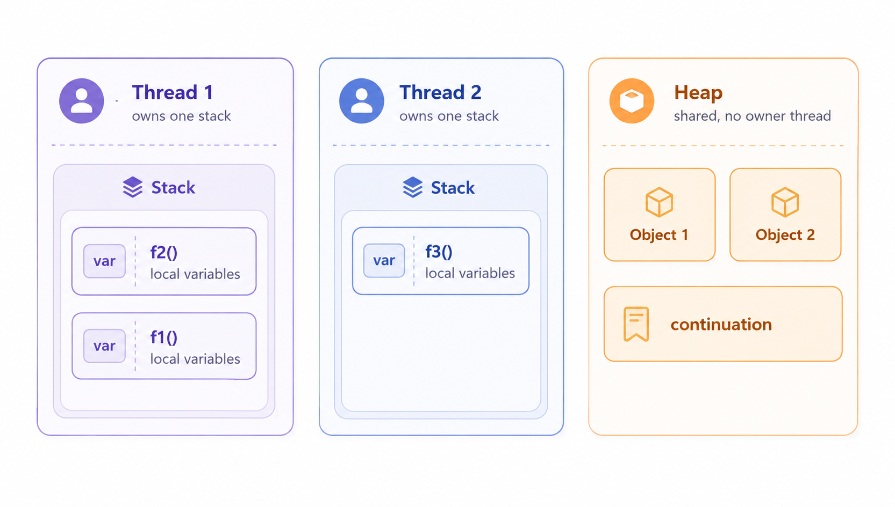
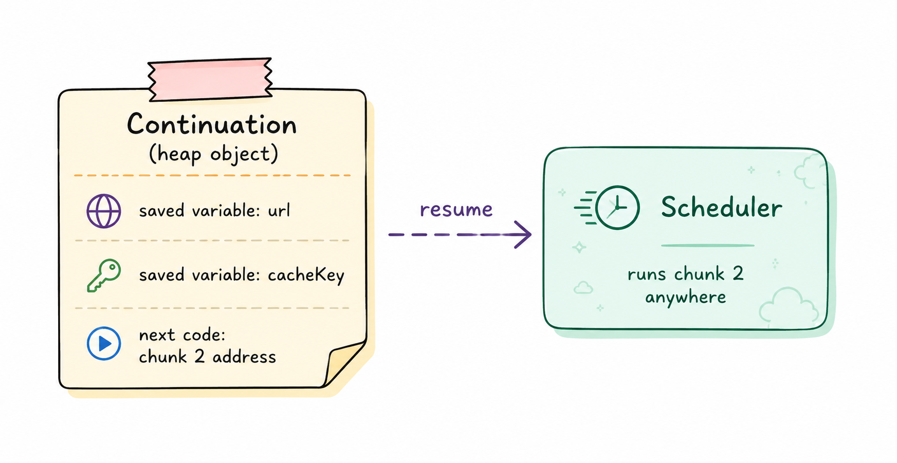
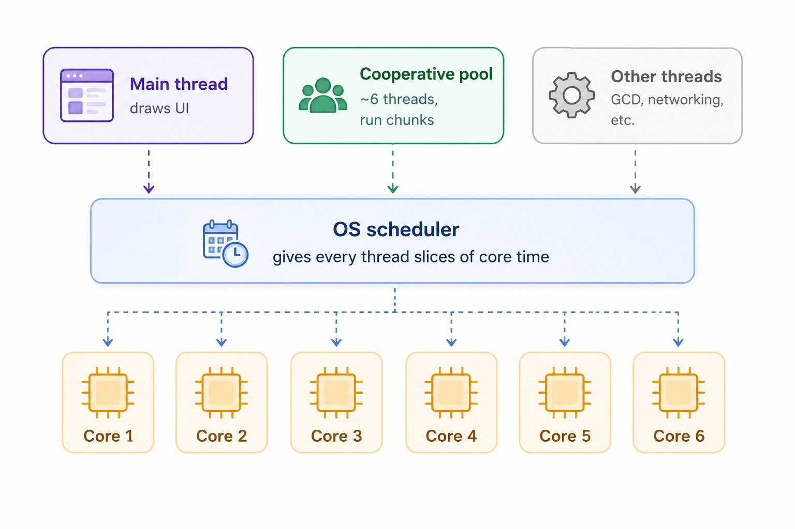
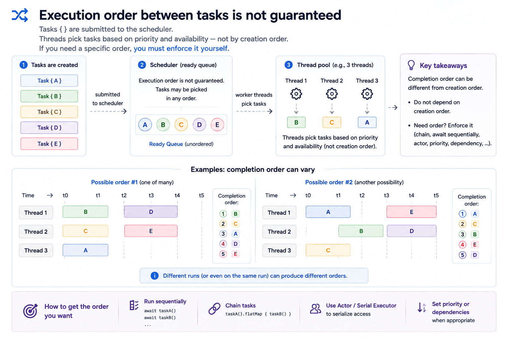

 ---
title: "Swift Concurrency (Phần 2), From Idea to Real-World Case"
description: "Swift Concurrency đứng trên đúng 4 ý tưởng. Hiểu chúng rồi thì mọi thứ 'khó hiểu' trở thành hệ quả bạn tự suy ra được."
icon: "article"
date: "2026-08-02T00:30:00+07:00"
lastmod: "2026-08-02T00:30:00+07:00"
draft: false
toc: true
weight: 999
---

# Tác giả : ChungHA

# Swift Concurrency (Phần 2): từ những idea tới các case thực tế triển khai từ đó.

 **Trước khi viết bài này mình đã đọc hết Swift-Evolution để biết các idea như nào, đọc hết mọi loại tài liệu tại sao Apple lại viết như thế và hướng tiếp theo Apple muốn làm là gì, và nếu bạn là Dev Android bạn có thể đọc bài suspend function hoạt động như thế nào trước khi đọc bài này của mình**

- Link : https://www.swift.org/swift-evolution/
- Link : https://speakerdeck.com/inamiy/iosdc-japan-2021?slide=124 , 1 Bài từ 2021 nhưng giá trị cực hay

**biết cú pháp không giống với hiểu hệ thống work như lào**. Tại sao compiler không cho truyền cái class này giữa các task? Tại sao một `actor` — vốn để bảo vệ state của mình — lại để state đổi ngay giữa method của chính mình? Tại sao chỉ một cái semaphore vô hại lại treo cả app? Chừng nào còn phải học thuộc câu trả lời theo từng case, Swift Concurrency vẫn cứ như một mớ luật rắc rối tùm lum. người mới học thì sẽ khóc mất.

Luận điểm của bài này là: **Swift Concurrency đứng trên đúng một nhỏ các ý tưởng, và một khi nhìn ra chúng, những thứ "khó hiểu" thôi không còn khó hiểu nữa** — chúng biến thành các hệ quả mà bạn có thể tự suy ra. Mọi thứ hoạt động như thế đều có lý do, và lý do thì hiểu được.

Có **4 ý tưởng chính mà mình thấy tâm đắc nhất khi đọc**:

1. Hàm thực sự chạy thế nào mà không cần chờ.
2. Isolation thực chất là gì và actor thực sự bảo vệ cái gì.
3. `Sendable` chứng minh điều gì, và sao cần impl nó.
4. Tại sao task có thể ở hai loại structured và unstructured.

 Mỗi ý tưởng kết thúc bằng một loạt **hệ quả**, và mỗi hệ quả là một tình huống thực từ code thật. Cả bài có 20 hệ quả, đánh số liên tục xuyên suốt.

Bắt đầu với ý tưởng đầu tiên, vì mọi thứ khác dựng trên nó.

## Ý tưởng : Không có chuyện "chờ". Chỉ có một hàm bị cắt thành từng phần.

Quên từ "await" đi một lát. **Không có gì trong Swift Concurrency thực sự "chờ" cả.** Để thấy điều gì thật sự xảy ra, ta cần hai phần kiến thức nền: thread là gì, và dữ liệu của một hàm sống ở đâu.

**Thread là gì.** Một thread là một "người thợ" do hệ điều hành cung cấp. Nó thực thi lệnh lần lượt, theo thứ tự, và mỗi lúc chỉ làm được đúng một việc. CPU core là phần cứng thực sự chạy thread: một con chip 6 core chạy được 6 thread *cùng lúc*. Hệ điều hành có thể tạo nhiều thread hơn số core, gọi là OS Thread, nhưng khi đó nó phải xoay vòng đưa thread lên/xuống core, và mỗi thread thì **đắt**: nó cần vùng nhớ riêng, và OS tốn thêm công quản lý nữa. 

--> Nó tốn kém, đắt đỏ --> Người ta mới phải làm sao rẻ đi...

--> Bạn nào code Android chắc mình nói cái này nhiều lần lắm rồi. kể cả trong những buổi dạy và **Concurrency**

**Ôn lại tí : Dữ liệu của function sống ở đâu: stack và heap.**

Một chương trình có hai loại bộ nhớ.

- **Stack** thuộc về một thread: mỗi thread có đúng một cái. Khi một thread chạy một hàm, các biến cục bộ của hàm được đặt lên stack của thread đó, và bị xoá sạch ngay khi hàm return. Nhanh, nhưng có hai ràng buộc cứng: dữ liệu chết cùng hàm, và chỉ với tới được từ đúng một thread đó.
- **Heap** thì ngược lại: một vùng dùng chung, không thuộc thread nào. Dữ liệu ở đó sống chừng nào còn có ai đó giữ tham chiếu tới nó, và thread nào cũng với tới được. Đây là nơi instance của class sống — đó là lý do một object có thể được truyền đi khắp nơi và sống lâu hơn cái hàm tạo ra nó.

Một trường hợp kết hợp cả hai, cần nói rõ vì lát nữa sẽ dùng: **một biến cục bộ kiểu class**. 
Viết `let session = NetworkSession()` bên trong một hàm, và dữ liệu tách làm hai. 
Bản thân object, với mọi property của nó, được tạo trong heap. Còn biến cục bộ `session` chỉ là một *tham chiếu* tới nó: một giá trị nhỏ (thực chất là địa chỉ của object trong bộ nhớ) nằm trên stack của thread như mọi biến cục bộ khác. Khi hàm return, tham chiếu trên stack bị xoá, nhưng object trong heap vẫn sống chừng nào còn ai khác giữ tham chiếu.



Ghi nhớ điểm khác biệt then chốt: **stack gắn với một thread và một hàm đang chạy, còn heap thì không gắn với cả hai.** 

**Compiler làm gì với một hàm async.** Khi bạn viết một hàm `async`, compiler **cắt nó thành từng phần nhỏ**. Đặt tên cho mỗi phần để dùng xuyên suốt bài: một **chunk** là một khối code đồng bộ (synchronous) liền mạch nằm giữa hai vết cắt. Vết cắt chỉ xảy ra tại `await`, không phải ở mọi dòng:

```swift
func loadAvatar() async throws -> UIImage {
    let cacheKey = "avatar-key"                  // chunk 1
    let url = try await fetchProfileURL()        // ← cắt: chunk 1 kết thúc bằng việc bắt đầu lời gọi,
                                                 //        chunk 2 bắt đầu bằng việc nhận url
    logger.log("got \(url)")                     // chunk 2
    let data = try await download(url)           // ← cắt thứ hai
    let image = decode(data)                     //
    cache.store(image, for: cacheKey)            // ] chunk 3
    return image                                 //
}
```

Một chi tiết để khỏi nhầm về vị trí cắt: dòng có `await` được **chia sẻ** giữa hai chunk. Hành động cuối của chunk 1 là *bắt đầu* lời gọi `fetchProfileURL()`. Nếu kết quả chưa sẵn sàng ngay, vết cắt xảy ra tại đúng thời điểm đó. Hành động đầu của chunk 2 là *nhận* kết quả và đặt vào `url`. Vậy dòng `await` không "nằm ngoài" các chunk — nó là **ranh giới** giữa chúng.

Giờ tới vấn đề. `url` được tạo ở chunk 1 nhưng dùng ở chunk 2. `cacheKey` tạo ở chunk 1 nhưng dùng còn muộn hơn, tận chunk 3. Giữa các chunk đó hàm **hoàn toàn không chạy**, và cái thread từng chạy chunk 1 không ngồi đó chờ: nó bỏ đi chạy code khác. Code khác đó cần chỗ trên stack, và nó lấy đúng chỗ mà chunk 1 đang dùng, ghi đè lên. Nên stack không thể mang gì qua khe hở đó, cùng lý do nó không mang được biến cục bộ của một hàm đã return: **stack thuộc về bất cứ thứ gì đang chạy ngay lúc này**. (Còn một lý do thứ hai nữa, các trang sau sẽ nói rõ: chunk sau khe hở thậm chí có thể không chạy trên cùng thread, mà một thread thì không với tới stack của thread khác.) Vì vậy compiler lưu các biến còn sống vào một object đặc biệt, và đặt object đó vào **heap** — vùng duy nhất sống sót qua mọi thứ và không thuộc thread nào.

**Object đó chính là continuation.** Nói cho chính xác ai sống ở đâu: các biến (`url`, `cacheKey`) được lưu *bên trong* continuation, còn bản thân continuation là một object trong heap. Cái tên đến từ khoa học máy tính và mang nghĩa đen: continuation là "tất cả những gì còn phải làm tính từ điểm này trở đi". Về mặt vật lý nó rất giống một closure: một nơi bộ nhớ chứa (a) các biến cục bộ đã lưu và (b) địa chỉ của đoạn code chạy tiếp theo, tức chunk kế. Khi kết quả `await` về, runtime lấy object này, đưa cho một thread, và thread nhảy tới địa chỉ đã lưu cùng các biến đã lưu. Hành động đó gọi là **resume** continuation. Chẳng có gì huyền bí: state đã lưu cộng với một cái "bookmark" nói "chạy tiếp từ đây".

--> Các con vợ code Coroutine thấy easy không?. biết Android thì học Swift dễ như ăn kẹp



**Vậy sao lại gọi là "await" nếu chẳng có gì chờ?** Bởi vì *có* một thứ chờ thật: **timeline logic của chính hàm bạn**. Từ góc nhìn của code bạn viết, dòng tiếp theo thật sự không chạy cho tới khi có kết quả. Timeline logic của hàm tạm dừng tại đó. Thứ *không* chờ là **thread**. Cái tên mô tả góc nhìn từ bên trong hàm, không phải bộ máy bên dưới, và Swift thừa hưởng nó từ C# và JavaScript, Có thể học từ Kotlin Coroutine nữa. "suspension point" (điểm tạm dừng) — và đó đúng là thuật ngữ tài liệu chính thức của Swift dùng: *await đánh dấu một suspension point thực sự*. Thực sự,  vì nếu kết quả lỡ mà sẵn sàng ngay, thì chẳng cần cắt gì và hàm cứ chạy tiếp.

**Ai chạy các chunk.** Swift Concurrency chạy chúng trên một **cooperative thread pool**: một nhóm thread do hệ thống tạo riêng để chạy chunk, xấp xỉ **một thread trên mỗi CPU core**, và con số đó **không bao giờ tăng thêm**. Một chiếc iPhone hiện đại có 6 core (con A19 Pro của iPhone 17 Pro: 2 performance + 4 efficiency), nên pool khoảng 6 thread. Đối lập với mô hình GCD cũ, nơi một thread bị block khiến hệ thống tạo thêm một cái nữa, rồi nữa, lên tới 64 thread — cái gọi là *thread explosion*, mỗi thread ngốn bộ nhớ và cost scheduler của OS. Cooperative pool chọn thoả thuận ngược lại: số thread nhỏ và cố định, đổi lại **code của bạn tuyệt đối không được block một thread trong pool**. Không có gì cưỡng chế điều này cả: compiler vẫn cho bạn làm, runtime cũng không can thiệp. Giữ lời hứa đó là việc của bạn, và các case dưới là hệ quả nếu bạn không tuân theo rule.

**Pool liên hệ thế nào với tất cả các thread khác.** Thread trong pool không phải phần cứng đặc biệt, cũng chẳng phải một loại thread riêng. Một app có nhiều thread: main thread, ~6 thread của cooperative pool, cộng thêm thread do GCD tạo, do bộ máy networking, do thư viện bên thứ ba. Tất cả đều là thread OS bình thường, và OS scheduler rải hết chúng lên cùng 6 core vật lý. Vậy nên thread pool **không sở hữu** core. Cái làm chúng thành "pool" chỉ là công việc và luật của chúng: chúng là thread mà Swift Concurrency dùng để chạy chunk, và chúng tuân theo giao kèo "không bao giờ block". Main thread **không** nằm trong nhóm này: nó tồn tại riêng, chạy UI, và Swift Concurrency coi nó là một executor riêng biệt (điều này quan trọng ở mục sau, khi `@MainActor` xuất hiện).

Lưu ý điều mà mô hình pool muốn lói tới: **một hàm đang suspended không có "thread đang chạy, thread đã chạy các suspedned đó"**. Nó không phải "đang tạm dừng trên thread 4, dự định quay lại đúng cái đó". Khi suspended, nó là một object trong heap, và câu hỏi "nó thuộc thread nào" *không có câu trả lời*, y như với bất kỳ object nào khác trong heap. Không có thread affinity — theo thiết kế. (Main thread và `@MainActor` là ngoại lệ đặc biệt với luật riêng, sẽ nói kỹ ở mục sau.)



Các câu hỏi để đi tiếp phần sau: Giá trị cực kỳ nếu bạn đã hiểu mình lói nững gì bên trên.

**Nếu số task nhiều hơn số thread thì sao?** Đó là trạng thái bình thường, không phải vấn đề gì cả. Một task đang suspended là object heap cỡ vài trăm byte, và nó **không chiếm thread nào cả**. Mười ngàn task trên sáu thread là chuyện thường: các chunk sẵn sàng nằm trong hàng đợi của scheduler, và thread nhặt lần lượt, ưu tiên cao trước. Để so sánh, một thread cần khoảng nửa megabyte stack cộng một chuyến vào kernel mỗi lần bị switch.

 Chính sự bất đối xứng này là toàn bộ lý do mô hình tồn tại: nhiều task suspended rất cheap, ghép lên vài thread expensive.

**6 thread nghĩa là mỗi lúc chỉ tải được 6 ảnh?** Không, và lý do làm rõ thread thực chất dùng để làm gì. Thread cần cho đúng một việc: **thực thi code**, tức chạy lệnh CPU. Chunk của hàm async chạy trên thread pool, nhưng "chạy code cần thread" đúng với *mọi* code trong hệ thống. Đây là 1 hàm loadimamge

```swift
func loadImageFromUrl(_ url: URL) async throws -> Image {
    let request = makeRequest(url)        // thread pool, chỉ một phần nghìn giây

    let (data, _) = try await URLSession.shared.data(for: request)
    // ← hàm suspend tại đây.
    //   Trong lúc truyền dữ liệu (99% thời gian) KHÔNG có code nào chạy cho lượt tải này,
    //   trên bất kỳ thread nào. Byte được chip mạng và OS chuyển đi.
    //   Khi response sẵn sàng, code hệ thống chạy thoáng qua trên một trong các
    //   "thread khác" ở sơ đồ trên và resume continuation.

    return decode(data)                   // lại thread pool: việc CPU thật sự
}
```

Phần nghe lạ là "không có code nào chạy". Vậy *ai* đang chờ dữ liệu? Không ai cả, theo nghĩa đen. Hệ thống hiện đại không cài đặt "chờ" bằng cách để một thread đứng trong vòng lặp hỏi "xong chưa?". Chúng cài đặt nó như một cái **chuông**. Yêu cầu được chuyển xuống OS rồi tới chip mạng — một thiết bị vật lý riêng, tự nó chuyển byte, không cần CPU thực thi gì. OS ghi chú "khi dữ liệu của request này về thì báo cho app", và cho tới khi chuông reo (một tín hiệu phần cứng gọi là *interrupt*), **không một lệnh nào** tốn cho lượt tải này.

, nên trong lúc chờ không tốn thread hay lệnh CPU nào.")

Vậy hạch toán cho 100 lượt tải đồng thời: dòng đầu và cuối của `loadImage` là những khoảnh khắc ngắn chạy code, còn phần truyền dữ liệu — chiếm gần như toàn bộ thời gian — tốn **0 thread và 0 CPU**. Đó là lý do cả 100 lượt truyền thật sự diễn ra đồng thờig. Thứ duy nhất bị chặn quanh mức 6 là **thực thi code đồng thời**: khi cả 100 ảnh về và cần decode, các chunk `decode(data)` sẽ chạy khoảng 6 cái một lúc. Và cái đó không phải điểm yếu của Concurrency, nó là phần cứng: chip có 6 core, nên hơn 6 phép tính vốn dĩ không bao giờ chạy cùng một khoảnh khắc. Thêm thread cũng không tính nhanh hơn, chỉ khiến chúng thay phiên nhau trên cùng 6 core mà vẫn phải trả giá switch.

**Còn một hàm mà làm cả hai loại việc thì sao?**

```swift
func loadAndDecode() async throws -> PreparedData {
    let raw = try await network.get()   // `cắt` của riêng nó ở đây
    return heavyDecode(raw)               // chunk của riêng nó: việc CPU thuần
}

// Phía người gọi chỉ thấy một await:
let data = try await loadAndDecode()
```

Từ phía người gọi chỉ có một `await`, và người gọi bị suspend suốt cả quãng thời gian đó. Nhưng một `await` đó chẳng nói gì về chuyện xảy ra bên trong. Bên trong `loadAndDecode`, chính Concurrency đó lặp lại một cách đệ quy: nó có cắt riêng tại `network.get()` và các chunk riêng. Chunk khởi động request chạy trên thread pool, rồi nó suspend để truyền dữ liệu (không thread, như ta vừa thấy), rồi chunk `heavyDecode` chiếm thật một thread pool, vì decode là việc CPU thuần. Vậy đúng như bạn đoán: một phần vòng đời của hàm này dùng thread pool, một phần không dùng gì, dù người gọi chỉ thấy một `await` liền mạch thôi. **Await một hàm chỉ nghĩa là "timeline của tôi tạm dừng cho tới khi nó return".** Nó dùng bao nhiêu thread bên trong, và khi nào, do các `vết cắt` của chính nó quyết định.

**Vậy khi nào thì ngỏm?** Chỉ khi một chunk *đang ở trên* một thread mà từ chối nhả nó ra: block nó, hoặc block quá lâu. Điều đó làm sai cách pool work, và các hệ quả dưới đây đều là biến thể của đúng một vi phạm này, cộng vài hệ quả trực tiếp của chuyện "không có thread nào chạy mãi 1 func".

### Hệ quả 1. Sau await, bạn có thể tỉnh dậy trên một thread khác.

```swift
func report() async {
    printCurrentThread()   // <NSThread: 0x...>{number = 4, ...}
    try? await Task.sleep(for: .seconds(1))
    printCurrentThread()   // <NSThread: 0x...>{number = 7, ...}
}

// Một helper đồng bộ, xem lưu ý bên dưới.
func printCurrentThread() {
    print(Thread.current)
}
```


Cùng một hàm, thread khác nhau, và đây là hành vi **đúng**: sau vết cắt, chunk kế đã tới bất cứ thread pool nào rảnh trước. Về cái helper — nó chứng minh luận điểm của mục này còn tốt hơn cả ví dụ: trong Swift 6 language mode, gọi `Thread.current` trực tiếp trong code async **không compile được**.

Foundation đánh dấu nó không khả dụng từ ngữ cảnh async, chính vì câu trả lời có thể đổi tại mỗi `await` và ngôn ngữ từ chối cho bạn phụ thuộc vào nó. Hỏi qua một hàm đồng bộ chỉ là cách lách để demo thôi.

Các con số `number = 7` **không** nghĩa là có ít nhất 7 thread trong pool.
Con số chỉ là một định danh giữa *tất cả* thread của tiến trình, và như đã thấy, một app đang chạy có rất nhiều thread ngoài pool. ~6 thread của pool mang bất cứ số nào chúng tình cờ nhận được. 
Ngoài ra, tỉnh dậy lại trên đúng thread cũ là *có thể*, nhưng đó là trùng hợp, không bao giờ là đảm bảo.
Đây là lý do thread-local storage và mọi thứ đánh chỉ mục theo "thread hiện tại" **có thể đổi** khi qua `await`. 
(Một ngoại lệ: code isolated tới `@MainActor` *luôn* resume trên main thread. Đó không phải thread affinity back về , đó là **isolation** — chủ đề của mục sau nữa, có thể phần 3)

 — không có gì đảm bảo quay lại thread A.")

**Cách làm đúng.** Rút ra hai nguyên tắc:

- **Đừng phụ thuộc vào thread hiện tại.** Bất cứ thứ gì lock theo "thread đang chạy" — thread-local storage, `Thread.current`, ID của thread — đều **có thể sai** khi qua `await`. Cần dữ liệu đi theo ngữ cảnh async thì dùng `@TaskLocal`, đừng dùng thread-local.
- **Cần main thread để đụng UI thì nói rõ bằng `@MainActor`.** Đừng cho rằng "await xong là tự khắc về main thread".

```swift
// ❌ SAI: cho rằng sau await vẫn ở main thread
func refresh() async {
    let data = await fetch()
    label.text = data          // có thể đang ở pool thread bất kỳ -> UI glitch/crash
}

// ✅ ĐÚNG: gắn @MainActor -> sau await chắc chắn resume trên main thread
@MainActor
func refresh() async {
    let data = await fetch()   // fetch chạy ở đâu cũng được,
    label.text = data          // nhưng dòng này chắc chắn trên main thread
}
```
--> Nhưng nếu chạy trong @MainActor từ đầu thì ví dụ đầu đúng nhé, nó bảo toàn context.

Nhớ exception đã nói: code thuộc `@MainActor` **luôn** resume trên main thread sau `await` — không phải vì thread affinity, mà vì cửa của main actor chỉ dẫn tới đúng một thread (sẽ rõ hơn ở Ý tưởng 2).

### Hệ quả 2. Đừng bao giờ lock qua await.

```swift
let lock = NSLock()

func update() async {
    lock.lock()
    let value = await compute()   // cắt: chunk 2 có thể chạy trên thread khác
    cache = value
    lock.unlock()                 // có thể bị gọi từ một thread chưa từng lock
}
```

Một lock kiểu mutex *ghi nhớ* thread nào đã lock nó và mong `unlock` từ đúng thread đó. Chunk 2 có thể chạy trên thread khác, nên `unlock()` vi phạm đó, và tài liệu Apple nói thẳng kết quả: unlock một lock từ thread khác là **undefined behavior**.

Trong thực tế, "undefined" diễn ra thành một trong kiểu, từ tốt nhất tới tệ nhất.

- **Tốt nhất:** runtime phát hiện unlock lạ và crash tiến trình ngay lập tức (`os_unfair_lock` làm vậy với thông báo rõ ràng). Khó chịu, nhưng bạn tìm ra bug ngay lần chạy test đầu.
- **Ở giữa:** internal của lock bị sai, và một `lock()` nào đó về sau dẫn tới, **deadlock vĩnh viễn**, thế là bạn đi debug nhầm chỗ.
- **Tệ nhất:** nó âm thầm *có vẻ* chạy được trên máy bạn, phiên bản OS của bạn, đưa ra production -> sai theo một trong hai kiểu trên trên máy người khác. Bug giờ vô hình trong code của bạn và không tài nào tái hiện trên máy bạn.

Độc lập với cả ba: trong lúc lock bị giữ qua suspension, mọi thread khác muốn nó đều bị block — mà đó tự nó đã là điều cấm. **Lock ổn trong code async, nhưng chỉ giữa hai `await`**

**Vì sao "giữa hai `await`" lại ổn?** Vì đoạn nằm giữa hai `await` là **một chunk đồng bộ** — nó chạy trọn trên một thread, không bị cắt (không có `await` thì không có vết cắt). Nên `lock()` và `unlock()` chắc chắn cùng một thread, và lock cũng chỉ bị giữ trong tích tắc. Mẹo là: **`await` trước, rồi mới khoá — và trong vùng khoá tuyệt đối không để lọt một `await` nào**:

```swift
func update() async {
    let value = await compute()   // await TRƯỚC, lúc này chưa cầm lock
    lock.lock()
    cache = value                 // critical section: KHÔNG có await bên trong
    lock.unlock()                 // cùng thread với lock() -> an toàn
}
```

Còn nếu state cần được bảo vệ *xuyên qua* cả những đoạn có `await`, thì lock tay không còn là công cụ đúng nữa — hãy để **`actor`** làm việc đó (nó serialize bằng "cửa", chẳng cần lock). Hoặc dùng **`Mutex`** trong framework `Synchronization` với `withLock { ... }`: cái API dạng closure này khiến bạn *không thể* nhét một `await` vào giữa vùng khoá, nên chặn lỗi ngay từ gốc.

### Hệ quả 3. Semaphore có thể treo cả app.

```swift
func loadSync() -> Data? {
    let sem = DispatchSemaphore(value: 0)
    var result: Data?
    Task {
        result = await load()
        sem.signal()
    }
    sem.wait()   // block thread hiện tại cho tới khi signal() được gọi
    return result
}
```

Semaphore là một blocking primitive: `wait()` chặn thread gọi cho tới khi ai đó gọi `signal()`.Ở đây là "khởi động việc async, block cho tới khi xong, trả kết quả một cách đồng bộ".

Cái bẫy: nếu bản thân `loadSync` chạy trên một thread pool, thì `sem.wait()` rút thread pool đó ra. Gọi nó từ nhiều chỗ cùng lúc và **mọi** thread pool đều kẹt trong `wait()`. Các chunk của `load()` đã sẵn sàng chạy, nhưng chạy chúng cần một thread pool rảnh, mà chẳng còn cái nào, và pool **không thể tăng thêm** để cứu bạn. Không ai bao giờ chạm tới `signal()`. Trên máy 2 core, chỉ hai lời gọi đồng thời là đủ đóng băng mọi thứ.
Đây là kiểu **deadlock production phổ biến nhất** trong các codebase bắc cầu giữa concurrency cũ và mới theo cách này. (Một mẹo debug hữu ích: một biến môi trường có thể thu pool xuống còn đúng một thread trong test, khiến mọi vi phạm kiểu này tái hiện ngay tức khắc.)

, nên chẳng còn thread rảnh nào chạy chunk của load() để gọi signal() — cả pool đứng hình, app treo.")

**Cách khắc phục.** Gốc rễ vấn đề là *ép một lời gọi async thành đồng bộ bằng cách block một thread pool*. Đừng bắc cầu kiểu đó. Cách đúng là để async "chảy" thẳng lên trên: hàm nào cần kết quả async thì chính nó cũng `async` và `await`, chứ đừng gói lại thành một hàm sync rồi ngồi chờ.

```swift
// ❌ SAI: ép async -> sync bằng semaphore, block thread pool
func loadSync() -> Data? {
    let sem = DispatchSemaphore(value: 0)
    var result: Data?
    Task { result = await load(); sem.signal() }
    sem.wait()                 // block thread pool -> nguy cơ deadlock cả pool
    return result
}

// ✅ ĐÚNG: giữ nguyên async, await trực tiếp
func load() async -> Data? {
    await realLoad()
}

let data = await load()        // nơi gọi cũng async, không block gì cả
```

Còn khi điểm gọi là code **đồng bộ thật sự** (một `@IBAction`, một delegate method), thì đừng ngồi chặn để chờ — mở một `Task` ở "rìa" thế giới async rồi cập nhật UI ngay trong đó:

```swift
@IBAction func didTapLoad() {
    Task {
        let data = await load()
        updateUI(data)         // nhớ nhảy về main actor khi đụng UI
    }
}
```

(Trường hợp bất khả kháng phải chặn ở một ranh giới sync cứng — ví dụ buộc phải implement một API đồng bộ của bên thứ ba — thì cú `wait()` đó tuyệt đối **không được** nằm trên một thread pool; hãy đẩy nó sang một thread/queue của riêng bạn. Nhưng coi đây là giải pháp cuối, gần như luôn luôn câu trả lời đúng là: đừng ép về sync.)

### Hệ quả 4. Thread.sleep cướp một core, Task.sleep thì free , -- đoạn này giống thread.sleep với delay.

```swift
Thread.sleep(forTimeInterval: 1)        // thread này bị chiếm để không làm gì trong 1s
try await Task.sleep(for: .seconds(1))  // không thread nào bị dính trong 1s;
                                        // một timer sẽ resume hàm
```

Trước hết, mỗi dòng làm gì. `Thread.sleep(forTimeInterval: 1)` bảo OS: cho *thread hiện tại* ngủ một giây. 

Thread không làm gì, nhưng vẫn **bị chiếm**: suốt cả giây đó nó không chạy được chunk của ai khác. 

`Task.sleep(for: .seconds(1))` suspend *hàm*, không phải thread nào: continuation vào heap, cộng một ghi chú trong timer của scheduler "một giây nữa, đưa continuation này về lại hàng đợi sẵn sàng".
Thread được nhả ra ngay tại vết cắt và dành cả giây đó chạy chunk của task khác, hoặc nghỉ nếu không có việc.
Task đang sleep tiêu tốn **0 thread-time**. 
Thread không "chờ để quay lại với nó", vì như mọi khi, chẳng có thread nào gắn với một hàm đang suspended cả.

Vì sao đây là hệ quả của Concurrency: pool có ~6 thread và không bao giờ thêm cái thứ bảy. 
Một thread kẹt trong `Thread.sleep` là, trong giây đó, một **core bị mất**: một phần sáu toàn bộ năng lực tính toán của app dành cho việc không làm gì. 
Nhìn từ ngoài, hai dòng trông y hệt ("code dừng một giây"), và đó chính là thứ làm dòng đầu nguy hiểm.

### Hệ quả 5. Thứ tự thực thi giữa các task không được đảm bảo, giống thread java phết.

```swift
for i in 1...5 {
    Task { print(i) }
}
// In 1...5 theo thứ tự bất kỳ.
```

Chunk ở đây nằm đâu? Mỗi thân `Task { }` tự nó được lập lịch như một chunk: tạo một task nghĩa là "bỏ code này vào hàng đợi của scheduler", và thân không có `await` bên trong đơn giản là một task gồm đúng một chunk. 

--> Vậy năm thân task rơi vào scheduler, và thread nhặt chúng theo ưu tiên và độ sẵn sàng, **không hứa hẹn sẽ chạy ccasi nào trước đâu** tạo-trước-chạy-trước.
Scheduler không phải serial queue: khác với `DispatchQueue.main.async` vốn đảm bảo thứ tự FIFO, 

`Task { }` chỉ đảm bảo code *sẽ* chạy, chứ không đảm bảo *khi nào* so với các anh em của nó.
Nếu cần thứ tự, hãy lấy nó một cách tường minh: `await` từng phần việc lần lượt, hoặc đẩy chúng qua một `AsyncStream` (nó giao giá trị theo đúng thứ tự chúng được tạo ra).



**Cách làm đúng.** Cần thứ tự thì phải lấy nó một cách **tường minh**, đừng trông vào may rủi của scheduler:

```swift
// ❌ SAI: 5 task độc lập -> thứ tự chạy KHÔNG đảm bảo
for i in 1...5 {
    Task { await process(i) }
}

// ✅ ĐÚNG: một Task bọc ngoài, await tuần tự -> chạy đúng 1..5
Task {
    for i in 1...5 {
        await process(i)
    }
}
```

Còn khi có nhiều nơi liên tục "đẩy" việc vào và bạn cần xử lý đúng thứ tự chúng được tạo ra, hãy dùng `AsyncStream` — nó provide giá trị theo đúng thứ tự producer submit:

```swift
for await value in stream {   // nhận đúng thứ tự producer đẩy ra
    handle(value)
}
```

Và đây là chỗ hay gây hiểu nhầm: **`actor` cũng KHÔNG cứu được.**

 Actor chỉ hứa các job của nó *không chồng lấn* (một lúc một cái, để khỏi data race), chứ **không hứa thứ tự** — nó có thể nhặt job ưu tiên cao lên chạy trước, và ngay cả các job cùng ưu tiên cũng không có cam kết FIFO. Khác hẳn `DispatchQueue` serial (luôn FIFO).

Nói kiểu Java cho dễ hình dung: actor giống `synchronized` — đảm bảo *loại trừ lẫn nhau* (mutual exclusion), nhưng thread nào giành được lock trước thì **không** theo thứ tự xếp hàng. Muốn đúng thứ tự thật thì đó là việc của `DispatchQueue` serial hoặc `AsyncStream`, không phải của actor.


## Kết bài phần 2.

**Phần 2** Đã giải thích cho các bạn vài thứ như sau, **phần 3** mình sẽ nói thêm

**Hàm không await**: chúng bị cắt tại mỗi `await` thành các chunk, state của chúng sống trong continuation ở heap, và một pool cố định khoảng một thread mỗi core chạy bất cứ chunk nào sẵn sàng.

**Dữ liệu không thuộc về thread**: nó thuộc về các isolation domain, mỗi domain có một cửa cho một job vào, và work tại mỗi suspension — đảm bảo transaction nhưng là bẫy reentrancy.

---