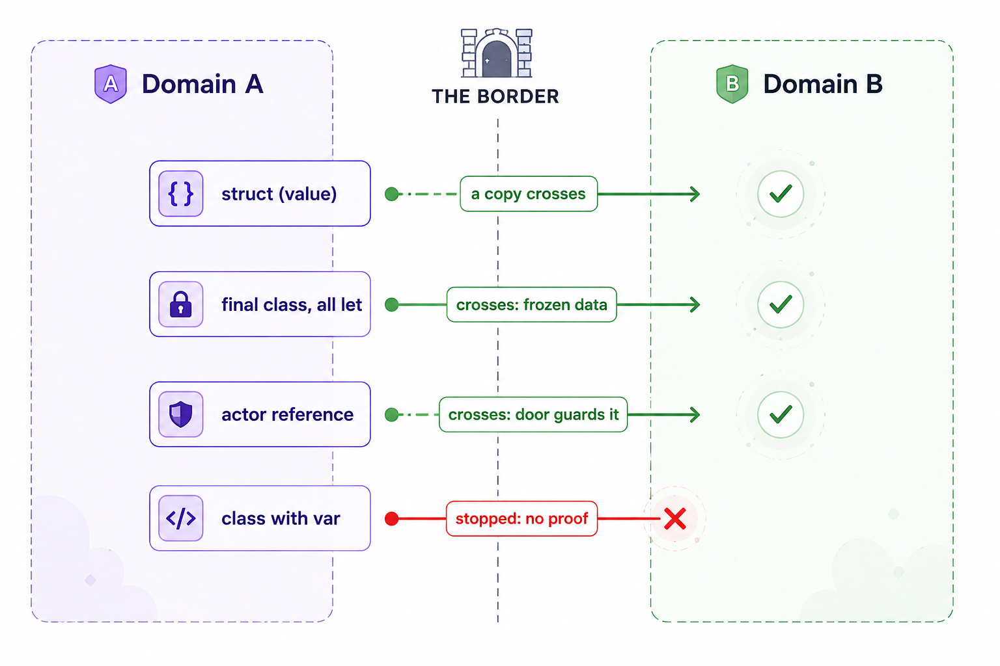
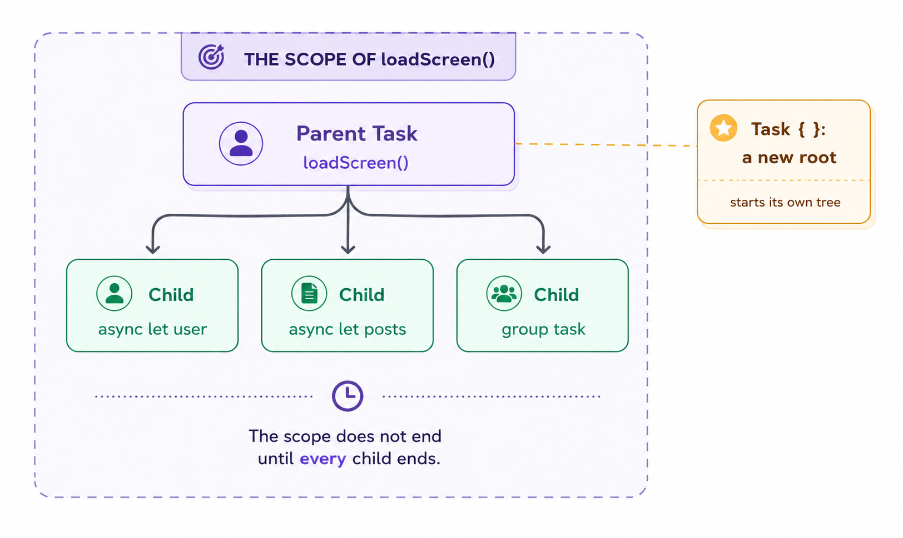

# Tác giả : ChungHA

# Swift Concurrency (Phần 3): Isolation, Sendable và trê Task

Nhắc nhanh lại [phần 2](../swift-concurrency-part2/) cho ai chưa đọc: **Ý tưởng 1** — hàm `async` bị compiler cắt thành các **chunk** tại mỗi `await`, state sống trong **continuation** ở heap, và một **cooperative pool** nhỏ (cỡ một thread mỗi core) chạy bất cứ chunk nào sẵn sàng. Mình đã đi qua 5 hệ quả đầu tiên của mô hình đó.

Phần 3 này mở màn bằng **hệ quả cuối cùng của Ý tưởng 1**, rồi bước sang ba ý tưởng còn lại: **isolation** (Ý tưởng 2), **Sendable** (Ý tưởng 3), và **cái cây task** (Ý tưởng 4). Số hệ quả đánh tiếp từ phần 2, nên bắt đầu ngay từ Hệ quả 6.

### Hệ quả 6. withCheckedContinuation trao continuation vào tay bạn, kèm nghĩa vụ.

Mọi thứ tới giờ đều giả định compiler quản lý continuation một cách vô hình. Có đúng một API nơi bạn chạm tay vào chúng: bắc cầu code callback cũ.

```swift
func download(_ url: URL) async -> Data {
    await withCheckedContinuation { continuation in
        legacyDownload(url) { data in
            continuation.resume(returning: data)
        }
    }
}
```

Compiler cắt `download` tại `await` như thường và tạo continuation: state đã lưu cộng bookmark tới phần còn lại của hàm. Nhưng nó không thể biết callback cũ của bạn khi nào sẽ nổ, nên thay vì tự resume, nó trao object continuation cho closure của bạn. Gọi `resume(returning:)` nghĩa là: "kết quả đây rồi, hãy lên lịch chạy phần còn lại của hàm đang suspended ngay bây giờ".

Điều này biến luật "gọi resume đúng một lần" từ thứ phải học thuộc thành thứ bạn có thể tự suy ra. Gọi **không lần nào**, và object continuation nằm mãi trong heap: phần còn lại của `download` không bao giờ chạy, ai await `download` bị suspend vĩnh viễn, và mọi thứ continuation đang giữ đều bị leak. Gọi **hai lần**, và bạn đang bảo runtime chạy lại phần còn lại của một hàm đã resume rồi, thứ có thể làm hỏng dữ liệu chương trình. Biến thể `checked` bạn thấy ở trên làm thêm chút kiểm tra để bắt cả hai lỗi: nếu continuation bị vứt đi mà chưa từng resume, runtime log một cảnh báo; nếu nó bị resume lần thứ hai, runtime dừng chương trình bằng một fatal error có chủ đích thay vì cho phép dữ liệu hỏng. Chính sự bảo vệ đó là lý do `withCheckedContinuation` nên là lựa chọn mặc định thay cho người anh em `unchecked`, dù có chút overhead nhỏ.

**Chốt lại.** Concurrency: hàm bị cắt tại các `await`, state sống trong continuation ở heap, một pool thread nhỏ cố định chạy bất cứ chunk nào sẵn sàng. Mọi luật trong mục này (không block, không giữ lock qua `await`, không giả định về thread, resume đúng một lần) đều là mô hình này áp dụng, không phải một sự thật riêng lẻ phải nhớ. Điều Concurrency *chưa* trả lời: nếu chunk nào cũng có thể chạy trên thread nào tại thời điểm nào, thì ai bảo vệ dữ liệu của bạn khỏi bị hai chunk chạm cùng lúc? Đó là **isolation**, ý tưởng tiếp theo.

## Ý tưởng 2: Isolation là quyền sở hữu dữ liệu, không phải điều khiển thread.

Ý tưởng 1 để lại cho ta một mối đe doạ. Nếu chunk nào cũng có thể chạy trên thread pool nào tại thời điểm nào, thì hai chunk có thể chạm cùng một biến cùng lúc. Xem cái giá của nó, với ví dụ nhỏ nhất có thể:

```swift
var likes = 0

// hai chunk chạy cùng lúc trên hai thread, mỗi cái làm:
likes += 1
```

`likes += 1` trông như một hành động, nhưng thực ra là ba: đọc giá trị hiện tại, cộng một, ghi kết quả về. Hai thread có thể xen kẽ ba bước đó. Cả hai đọc 0, cả hai cộng một, cả hai ghi 1, và một lượt like mất vĩnh viễn. Đây là **data race**, và trong Swift nó không chỉ là "thi thoảng ra số sai". Ngôn ngữ tuyên bố data race là **undefined behavior**, cùng loại với vụ unlock lạ ở Hệ quả 2: bất cứ điều gì cũng có thể xảy ra, kể cả hỏng bộ nhớ, và nó có thể hiếm tới mức sống sót qua mọi lần test của bạn.

**Câu trả lời cũ và câu trả lời mới.** Cách cổ điển để ngăn chuyện này là điều khiển *thread*: bọc biến trong một lock, hoặc dồn mọi truy cập qua một serial queue, và *hy vọng* mọi chỗ trong codebase đều nhớ làm vậy. Phần "hy vọng" chính là vấn đề. Chẳng có gì ngăn một đồng đội mới (hoặc chính bạn, sáu tháng sau) chạm `likes` trực tiếp, và compiler sẽ không nói một lời. Swift Concurrency lật ngược cách tiếp cận. Thay vì điều khiển thread nào chạy khi nào, nó **gán cho mỗi mẩu state có thể thay đổi một người chủ**, và bắt compiler kiểm tra quyền sở hữu trên từng dòng code, tại compile time. Người chủ đó gọi là **isolation domain**: một tập dữ liệu cộng một luật đơn giản — *chỉ code thuộc domain này mới được chạm dữ liệu này*. Mọi function và closure trong chương trình thuộc về đúng một domain (hoặc không domain nào, cũng là một trạng thái tường minh). Compiler biết domain của mỗi dòng và domain của mỗi biến, và **từ chối compile** một dòng với tay qua ranh giới.

**Actor là một cỗ máy để tạo ra domain.** Khai báo một cái là bạn có cả gói: state, code sở hữu nó, và sự cưỡng chế.

```swift
actor LikeCounter {
    var likes = 0            // state do domain này sở hữu

    func register() {        // code thuộc về domain này
        likes += 1           // được phép: cùng domain
    }
}
```

Mọi thứ khai báo bên trong actor thuộc về domain của nó. Code bên ngoài thì không, nên nó không thể với tới `likes` theo kiểu với tới property của một class thường. Nó vẫn lấy được giá trị, nhưng chỉ bằng cách đi qua **cửa trước** của actor, với `await` — và ta sẽ thấy ngay cái cửa đó làm gì. Tới đây thì mới chỉ là một bộ nhãn dán lên code và dữ liệu. Phần thú vị là truy cập từ bên ngoài hoạt động ra sao: **actor đảm bảo mỗi lúc nhiều nhất một job chạy bên trong domain**. Một lời gọi từ ngoài trở thành một job trong hàng đợi của actor, các job vào từng cái một, và trong khi một cái đang bên trong, số còn lại xếp hàng chờ. Đây là lý do data race chết: chuỗi đọc-cộng-ghi không còn xen kẽ được với ai nữa, vì chẳng ai khác ở bên trong.



**Actor không phải là một thread.** Đây là hiểu nhầm phổ biến nhất, nên hãy mổ xẻ nó. Actor không sở hữu thread, không tạo thread, và method của nó không chạy "trên thread của actor", vì chẳng có cái thread nào như thế tồn tại. Actor chỉ là hai thứ: một hàng đợi ở cửa, và luật "một job bên trong". Cái job đang ở bên trong chạy các chunk của nó trên chính cooperative pool từ Ý tưởng 1, trên bất cứ thread nào rảnh. Mười ngàn actor trên 6 thread vẫn ổn, cùng lý do mười ngàn task vẫn ổn: một actor mà cửa không có ai xếp hàng chỉ là một object trong heap, chẳng tốn thread nào.

```swift
actor LikeCounter {
    var likes = 0
    func register() {
        likes += 1
        print(Thread.current)   // các lời gọi khác nhau chạy trên các thread pool khác nhau
    }
}
```

Các lời gọi vẫn chạy từng cái một, dù thread cứ đổi liên tục. Cái bảo vệ state là **hàng đợi ở cửa**, không phải điều gì đó về bản thân các thread.

**Vì sao gọi một actor cần await.** Từ bên ngoài, mọi lời gọi đi qua cửa, và cửa có thể đang bận. Nên lời gọi là một suspension point tiềm năng, và Ý tưởng 1 đã bảo ta chính xác điều đó nghĩa là gì: hàm của bạn có thể bị cắt tại đây, trở thành continuation trong heap, và nhả thread. **Không có thread nào đứng xếp hàng ở cửa.** Hàng đợi là một hàng các continuation, đó là lý do một ngàn người gọi chờ một actor chẳng tốn gì.

```swift
let current = await counter.likes   // ngay cả đọc một property từ bên ngoài
await counter.register()            // vượt ranh giới = suspension point tiềm năng
```

**`@MainActor` là cùng cỗ máy đó với một tính chất đặc biệt.** Main actor là một actor toàn cục dùng chung, mà cửa của nó dẫn tới một executor cụ thể: **main thread**. Đánh dấu code `@MainActor` và nó thuộc về domain của main actor, nghĩa là hai điều cùng lúc: nó tuân theo cửa (một job mỗi lúc), và các chunk của nó chạy cụ thể trên main thread chứ không phải trên pool. Nhớ ngoại lệ ở Hệ quả 1: code `@MainActor` *luôn* resume trên main thread sau `await`. Giờ ta thấy vì sao. Đó không phải thread affinity quay lại, mà đơn giản là cửa của main actor dẫn tới đúng một người thợ — main thread. Khác biệt giữa "`@MainActor`" và "main thread" là khác biệt giữa một khái niệm compile-time và một người thợ vật lý: domain là tập dữ liệu và code mà compiler kiểm tra tư cách thành viên, còn main thread là người thợ mà cửa của main actor tình cờ dẫn tới. Giao diện UIKit và SwiftUI được đánh dấu `@MainActor` chính là để cái luật "UI phải được chạm từ main thread" — vốn là luật runtime mà bạn phát hiện qua những lần crash — trở thành một luật compile-time mà compiler cưỡng chế giúp bạn.

**`nonisolated` là lối ra tường minh.** Đôi khi một method của actor chẳng chạm gì vào state có thể thay đổi, và bắt mọi người gọi đi qua cửa (và qua `await`) sẽ vô nghĩa. Đánh dấu `nonisolated` gỡ nó ra khỏi domain: nó có thể được gọi từ bất cứ đâu mà **không cần `await`**, và đổi lại compiler cấm nó chạm vào state có thể thay đổi của actor. Đọc hằng `let` bất biến thì vẫn được, vì dữ liệu không bao giờ đổi thì không thể race.

```swift
actor LikeCounter {
    let postID: String   // bất biến
    var likes = 0

    nonisolated func describe() -> String {
        "Counter for \(postID)"   // ổn: postID không bao giờ đổi
        // "likes: \(likes)" sẽ không compile: state thay đổi được, sai domain
    }
}
```

Giờ tới các hệ quả. Đánh số tiếp từ Ý tưởng 1, vì tất cả đều là hệ quả của cùng một mô hình. Cái đầu tiên ở đây đứng sau một phần lớn các bug actor ngoài đời thực.

### Hệ quả 7. Actor reentrancy: cửa bảo vệ chunk, không phải cả method.

Trước hết, vì sao điều này *suy ra được từ các ý tưởng* chứ không phải một luật riêng phải học thuộc. Từ Ý tưởng 1: tại một `await`, hàm bị cắt, trở thành continuation trong heap và nhả thread, và không gì trong mô hình được phép ngồi block chờ. Giờ hỏi: cửa của actor *nên* làm gì trong lúc job bên trong đang suspended tại một `await`, chờ một lời gọi mạng? Nếu cửa cứ khoá, actor sẽ làm đúng cái điều bị cấm: ngồi block chờ việc bên ngoài, từ chối mọi người, chẳng đạt được gì, có khi hàng giây. Vậy nên **cửa mở ra mỗi khi job bên trong suspend**. Nghĩa là đơn vị mà actor serialize là **chunk**, không phải cả method. Mọi thứ dưới đây là cái giá của điều đó.

Đây là một tài khoản ngân hàng kiểm tra số dư trước khi chi, đúng như ngân hàng của bạn làm:

```swift
actor BankAccount {
    var balance = 100

    func withdraw(_ amount: Int) async -> Bool {
        guard balance >= amount else { return false }   // kiểm tra: đủ tiền không
        let approved = await fraud.verify(amount)       // ← rời khỏi phòng ở đây
        guard approved else { return false }
        balance -= amount                               // chi
        return true
    }
}
```

Gọi `withdraw(80)` hai lần cùng lúc, với số dư 100. Trực giác bảo actor serialize các lời gọi, nên lần thứ hai phải thất bại. Thực tế: **cả hai đều thành công, và số dư thành -60.**

Suy luận ở trên giải thích. Khi lời gọi đầu chạm `await fraud.verify`, nó suspend: trở thành continuation và **rời khỏi phòng**. Cửa giờ trống. Lời gọi `withdraw(80)` thứ hai bước vào, kiểm tra `balance >= 80` với con số 100 vẫn còn nguyên, qua, và cũng suspend tại `verify`. Rồi cả hai phê duyệt về, cả hai continuation trở lại (từng cái một, cửa vẫn hoạt động), và cả hai trừ 80. Từng chunk riêng lẻ đều được serialize hoàn hảo, mà logic vẫn hỏng, vì **giả định trước `await`** ("số dư ít nhất là 80") không còn đúng sau nó.

Tính chất này gọi là **reentrancy**: trong khi một job đang suspended tại `await`, actor có thể chạy các job khác. Luật nó sinh ra: **sau mỗi `await` bên trong một actor, state của bạn có thể đã đổi, và mọi giả định phải được kiểm tra lại.**

```swift
func withdraw(_ amount: Int) async -> Bool {
    guard balance >= amount else { return false }
    let approved = await fraud.verify(amount)
    guard approved, balance >= amount else { return false }   // kiểm tra lại sau await
    balance -= amount
    return true
}
```

### Hệ quả 8. Code đồng bộ trong actor là một transaction, và await kết thúc nó.

Đây là suy luận của Hệ quả 7 đọc theo chiều ngược lại. Cửa chỉ mở khi job bên trong suspend. Ý tưởng 1 nói suspension chỉ xảy ra tại một `await`, vì đó là chỗ duy nhất compiler cắt. Không `await`, không cắt, không mở cửa. Vậy nên **mọi thứ giữa hai `await` chạy không bị gián đoạn bởi job actor khác**. Một khối code đồng bộ bên trong actor thực chất là một **transaction**: đọc, quyết định, sửa, và không ai xen vào được. Nên kỹ thuật thực chiến khi thiết kế actor là: giữ mỗi chuỗi "quyết định và sửa" không có `await` bên trong, và coi mỗi `await` là một ranh giới transaction. Nếu phần kiểm tra và phần mutation nằm trong cùng một khối đồng bộ, bug ngân hàng ở trên là **bất khả thi**:

```swift
func withdrawIfPossible(_ amount: Int) -> Bool {   // hoàn toàn không có await bên trong
    guard balance >= amount else { return false }
    balance -= amount                              // kiểm tra + chi: một transaction
    return true
}
```

### Hệ quả 9. Đừng ghé thăm actor cho từng việc nhỏ: mỗi cú "nhảy" đều có giá.

Cái này suy ra thẳng từ "vượt ranh giới là một suspension point tiềm năng". Mỗi lần vượt ranh giới domain có thể suspend bạn, đẩy một continuation qua scheduler, và với `@MainActor` thì chuyển đổi giữa pool và main thread. Từng cú nhảy lẻ thì rẻ, nhưng một vòng lặp vượt ranh giới ở *mỗi* vòng lặp thì trả cái giá đó hàng ngàn lần:

```swift
// Tệ: 10 000 lần vượt ranh giới
for item in items {
    await store.add(item)
}

// Tốt: một lần vượt, một transaction
await store.addAll(items)
```

Bản năng đó cũng áp dụng cho `@MainActor`: gộp các cập nhật UI vào một lượt ghé thay vì nhảy về main thread cho từng cái label. Và vì main actor vừa được nhắc tới, hai hệ quả tiếp theo nói riêng về nó. Chúng nên được đọc theo thứ tự.

### Hệ quả 10. Một chunk đồng bộ dài trên main actor vẫn đóng băng UI.

Suy luận: một thread mỗi lúc làm một việc (sự thật đầu tiên của Ý tưởng 1), và cửa của main actor dẫn tới đúng một thread, mà thread đó lại còn có việc thứ hai: chạy event loop của app, vẽ frame, phản ứng với chạm. Trong lúc một chunk main-actor đang chạy, main thread **không làm gì khác được**, kể cả vẽ. Actor chẳng thay đổi điều này. Nếu chunk của bạn tốn hai giây CPU, màn hình đơ hai giây, đúng y như thời trước khi Swift Concurrency tồn tại.

```swift
@MainActor
func refresh() async {
    let data = await api.fetch()    // suspension: main thread rảnh,
                                    // UI vẽ và phản hồi bình thường

    let model = parse(data)         // chunk đồng bộ CHẠY TRÊN main thread:
                                    // 2 giây parse = 2 giây UI đóng băng

    render(model)
}
```

Thứ *không* đóng băng gì là **chờ**. Tại một `await`, job main-actor suspend và main thread được trả về cho event loop của nó: frame vẽ, nút phản hồi. Và việc trên các thread pool không block main thread, vì đó là những người thợ khác nhau. Nói cho thật chính xác: chúng *có* cạnh tranh cùng các core vật lý (sơ đồ trước cho thấy mọi thread dùng chung core), nhưng OS scheduler cho main thread ưu tiên cao hơn, nên việc trên pool trong thực tế không làm khựng UI.

Mô hình cũng trao cho bạn cách sửa: một cú đóng băng là một chunk nặng CPU sống nhầm domain. Đưa nó ra ngoài, bằng `@concurrent` (xem Hệ quả 11) hoặc một actor của riêng nó, rồi chỉ quay về main actor cho bước cuối rẻ tiền — cập nhật UI.

### Hệ quả 11. Một method async chạy ở đâu? Khai báo của nó quyết định, và Swift 6.2 đã đổi câu trả lời mặc định.

Vì sao mô hình biến chuyện này thành một hệ quả: Ý tưởng 2 nói mỗi dòng code thuộc về đúng một domain. Nên câu hỏi "method này sẽ chạy ở đâu" thực ra là câu hỏi "method này thuộc domain nào", và điều đó được quyết định một lần, tại **khai báo** của method. **Chỗ gọi không bao giờ quyết định.** Cụ thể, `await` tại chỗ gọi chỉ đánh dấu một suspension khả dĩ, nó không gửi gì đi đâu cả. Đây là bốn kiểu khai báo khả dĩ, và đây cũng là chỗ Swift 6.2 xuất hiện, vì nó đổi ý nghĩa của cái thứ ba:

```swift
actor ImageCache {
    func lookup(_ key: String) -> UIImage? { ... }
    // Isolated tới ImageCache. Chạy trong domain của cache,
    // các chunk của nó đi ra cooperative pool.
}

@MainActor
func refreshTitle() async { ... }
// Isolated tới main actor. Chạy trên main thread.

func parseFeed() async { ... }
// Không ghi domain. ĐÂY là thứ Swift 6.2 đã đổi:
//   trước 6.2: một hàm như vầy luôn nhảy ra pool
//   từ 6.2:    nó chạy trong domain của kẻ GỌI nó
// Hành vi mới có cách viết tường minh, và bạn có thể yêu cầu nó
// cho từng hàm bất kể cấu hình project:
//   nonisolated(nonsending) func parseFeed() async { ... }
// Cấu hình project 6.2 đơn giản biến cái này thành mặc định
// cho mọi hàm async không nói khác đi.

@concurrent
func heavyDecode() async -> UIImage { ... }
// Pool, luôn luôn, theo yêu cầu tường minh. Bất kể ai gọi.
```

Giờ một chỗ gọi, gọi cả bốn từ main actor:

```swift
@MainActor
func tap() async {
    await imageCache.lookup("key")  // chạy trong domain của cache (thread pool)
    await refreshTitle()            // chạy trên main thread, không vượt ranh giới
    await parseFeed()               // default 6.2: main actor. Trước 6.2: pool
    await heavyDecode()             // pool, tường minh
}
```

Bốn cái `await` trông y hệt nhau, bốn đích đến khác nhau, và mọi câu trả lời đều đã được viết tại khai báo. Còn một default 6.2 nữa cùng tinh thần: một app module có thể biến `@MainActor` thành domain mặc định cho mọi kiểu và hàm chưa đánh dấu (project Xcode mới bật cái này), nên code app khởi đầu đời thuộc sở hữu của main actor và chỉ bước ra ngoài ở nơi nó nói rõ.

Điều này dẫn tới câu hỏi mà lúc này bạn nên tự hỏi: nếu `parseFeed` trước đây chạy trên pool và giờ chạy trên main actor, thì cùng một hàm chưa từng đóng băng UI trước đây giờ có thể đóng băng nó, chỉ vì cấu hình project? Đúng, có thể, và đây là hạch toán chính xác khi nào. **Chờ không bao giờ chiếm thread**, dưới mọi cấu hình: trong lúc `await`, hàm là một continuation trong heap, và điều đó chẳng tốn gì của main thread. Cái mà cấu hình dịch chuyển giữa các domain chỉ là các **chunk đồng bộ** của hàm. Với một hàm networking điển hình, đó là vài microgiây code quanh vài giây chờ, nên chẳng có gì thấy được đổi. Một cú đóng băng chỉ xuất hiện trong đúng một kịch bản: hàm chứa việc CPU thật sự nặng, và nó đã âm thầm dựa vào cú nhảy ra pool ngày xưa.

Và đó là **tính năng, không phải bug**. Cách sắp xếp cũ khiến code kiểu đó trông an toàn một cách tình cờ: việc nặng rời main thread nhờ một luật vô hình mà nửa team không biết là có, và không gì trong source nói ra. Cách sắp xếp mới khiến code *có nghĩa đúng như nó viết*. Việc CPU nặng phải được **gọi tên**, với `@concurrent` hoặc một actor của riêng nó, và một khi đã đặt tên, chỗ chạy của nó được viết trong khai báo và không phụ thuộc default nào. Default giờ chỉ quyết định số phận của code chưa đánh dấu, và code chưa đánh dấu thì nên nhẹ. Bạn mất đi một tấm lưới an toàn tình cờ và có được một codebase nơi "cái này chạy ở đâu" được trả lời bằng cách đọc khai báo, không phải bằng cách thuộc lòng "văn hoá dân gian" của từng phiên bản compiler.

**Chốt lại.** Data race chết khi dữ liệu có người chủ và compiler kiểm tra quyền sở hữu. Một actor là một domain với một cái cửa, một job bên trong mỗi lúc, và không có thread riêng. Cửa mở tại mỗi `await`, cho bạn cả *đảm bảo transaction* (giữa các `await`) lẫn *cái bẫy reentrancy* (vắt qua chúng). Nhưng một câu hỏi giờ đã quá hạn. Job liên tục truyền giá trị qua cửa: đối số vào, kết quả ra. Nếu tôi trao một object có thể thay đổi vào một actor và giữ một tham chiếu tới nó ở bên ngoài, thì cả hai phía giờ đều chạm được nó, và cái cửa chẳng bảo vệ được gì. Ai kiểm tra cái gì được phép đi qua? Kiểm tra đó có tồn tại, nó có một cái tên bạn đã thấy trong lỗi compiler nhiều lần, và nó là ý tưởng tiếp theo: **Sendable**.

## Ý tưởng 3: Sendable là một bằng chứng, không phải một hành vi.

Ý tưởng 2 kết thúc bằng một lỗ hổng ở cửa, nên hãy bắt đầu bằng cách rơi vào nó:

```swift
final class Draft {
    var text = ""
}

actor Publisher {
    var pending: [Draft] = []
    func submit(_ draft: Draft) {
        pending.append(draft)       // actor giờ giữ một tham chiếu
    }
}

let draft = Draft()
await publisher.submit(draft)       // draft giờ ở bên trong domain...
draft.text = "edited outside"       // ...và vẫn ở bên ngoài. Cùng một object,
                                    // hai domain, state thay đổi được. Data race
                                    // quay lại, và actor không hề hay biết.
```

Cửa kiểm tra *ai* vào. Nó không kiểm tra *họ mang theo gì*. Ta trao một tham chiếu tới một object có thể thay đổi qua cửa và giữ một bản sao của tham chiếu ở ngoài, và giờ hai domain có thể chạm `draft.text` cùng lúc. Toàn bộ bộ máy của Ý tưởng 2 vẫn nguyên vẹn và vô dụng ở đây. Nên phải có một kiểm tra thứ hai, lên **hành lý**: những giá trị nào an toàn để truyền qua ranh giới domain?

**Tiêu chí.** Một giá trị an toàn để trao qua ranh giới nếu việc trao nó **không thể tạo ra state thay đổi được mà nhìn thấy từ hai domain cùng lúc**. Đó là toàn bộ yêu cầu. `Sendable` là cái tên Swift đặt cho tính chất này, và đây là phần khiến nó thấy lạ cho tới khi bạn hiểu ra: **conform `Sendable` không phải là cài đặt cái gì cả**. Protocol này rỗng, không có method, không sinh ra code và không đổi gì lúc runtime. Nó chỉ tồn tại như một *lời tuyên bố* — "giá trị của kiểu này an toàn để gửi qua ranh giới" — và việc của compiler là **kiểm tra bằng chứng** cho lời tuyên bố đó. Đây là lý do `Sendable` cư xử khác mọi protocol khác bạn biết: bạn không viết implementation của nó, bạn thoả mãn sự **verify** của nó.

Có ba cách trung thực để chứng minh lời tuyên bố.

**Bằng chứng một: bằng copy.** Struct và enum là value type, và vượt ranh giới trao cho bên nhận một *bản sao*. Thay đổi trên một bản sao không lan ra, nên state thay đổi được dùng chung không thể xuất hiện — miễn là mọi stored property tự nó cũng `Sendable`, điều compiler kiểm tra đệ quy. Một nghi ngờ hay gặp: struct có property `var` và method `mutating`, đó chẳng phải state thay đổi được sao? Đúng, nhưng đó là state thay đổi được **mà bạn sở hữu một mình**. Một method `mutating` đổi bản sao *của bạn*, và bản sao mà domain kia nhận vẫn nguyên. Tính thay đổi của một struct sống trong cái *biến* giữ nó, không bao giờ trong thứ gì dùng chung. Nên câu trả lời thẳng cho "value type có Sendable mặc định không" là **có**, dưới đúng hai điều kiện: nó là value type, và mọi thứ chứa bên trong cũng `Sendable`. Compiler thậm chí áp dụng bằng chứng giúp bạn, nhưng chú ý ranh giới: **chỉ với các kiểu non-public**. Struct và enum non-public thoả điều kiện thì conform ngầm định, không cần bạn viết một chữ. Kiểu public *không bao giờ* được tự động conform, vì `Sendable` trên một kiểu public là một *lời hứa trong API của bạn* ("kiểu này sẽ vẫn an toàn để gửi qua ranh giới ở mọi phiên bản tương lai"), và một lời hứa với người lạ là của bạn, không bao giờ của compiler. Nhớ cái phân đôi public/non-public này, nó sẽ quay lại ở cuối ý tưởng.

**Bằng chứng hai: bằng tính bất biến.** Một class mà mọi stored property là `let` của một kiểu `Sendable`, và là `final` để không subclass nào thêm bất ngờ. Ở đây chia sẻ một tham chiếu là ổn, cả hai domain thấy cùng một object, nhưng chẳng có gì bên nào đổi được. **Dữ liệu đóng băng không thể race.**

**Bằng chứng ba: bằng cái cửa.** Actor tự động là `Sendable`, và giờ ta nói chính xác được vì sao: chia sẻ một tham chiếu tới một actor là chia sẻ *quyền truy cập vào hàng đợi*, không phải vào state. Bất kể domain nào giữ tham chiếu, mọi lần chạm state vẫn đi qua cửa, một job mỗi lúc. Tham chiếu an toàn để truyền đi chính vì nó **không** trao quyền truy cập trực tiếp vào bất cứ thứ gì.

Còn `Draft` của ta, một class với một `var`? **Không bằng chứng nào trong ba áp dụng được.** Copy không xảy ra (nó là reference type), bất biến thì vắng mặt (có một `var`), và không có cửa. Compiler không nói class viết dở. Nó nói một điều hẹp hơn và thành thật hơn: *không tồn tại bằng chứng nào về tính an-toàn-qua-ranh-giới cho kiểu này, nên nó sẽ không cho kiểu này vượt qua*. Mọi lỗi compiler `Sendable` bạn từng thấy đều chính xác là câu này.

> *Sơ đồ: Sendable là trạm hải quan ở ranh giới domain — bản sao, class đóng băng, và tham chiếu được-cửa-canh thì qua; state thay đổi được không được bảo vệ thì bị chặn.*

### Hệ quả 12. Vì sao struct lọt qua còn class thì không.

```swift
struct Message: Sendable {          // bằng chứng bằng copy, kiểm tra từng thành viên
    let text: String
    let date: Date
}

final class Draft {                 // một var, không cửa, reference type: không bằng chứng
    var text = ""
}

@MainActor
func send(_ m: Message, _ d: Draft) async {
    await publisher.accept(m)       // compile được: actor nhận một bản sao
    await publisher.edit(d)         // lỗi: gửi đi có nguy cơ gây data race
}
```

Cái thông báo lỗi hằng ngày rốt cuộc cũng đọc ra đúng bản chất của nó. Compiler không phàn nàn về style, nó đang báo cáo một **bằng chứng thất bại**: giá trị này sẽ vượt một ranh giới, và không lập luận nào trong ba lập luận an toàn đứng vững. Cách sửa suy ra từ chính các bằng chứng, chọn một: biến nó thành value type (bằng chứng bằng copy), đóng băng nó thành các hằng `let` của một `final class` (bằng chứng bằng bất biến), hoặc biến nó thành actor (bằng chứng bằng cửa).

### Hệ quả 13. Closure cũng vượt ranh giới, và @Sendable là cùng một kiểm tra cho chúng.

Một closure có thể được lưu và truyền đi như bất kỳ mẩu dữ liệu nào, và nó có thể vượt ranh giới domain, ví dụ khi bạn trao một completion handler cho code sẽ chạy nó ở nơi khác. Nhưng nhìn kỹ closure thực chất là gì: một **reference type**. Nó mang một cái hộp trong heap chứa các biến đã capture, và truyền closure đi là truyền một tham chiếu tới đúng cái hộp dùng chung đó, không phải một bản sao. Đó chính xác là thứ làm closure thành "hàng hoá nguy hiểm": một `var` đã capture trong hộp là state thay đổi được, và mọi domain giữ closure đều thấy cùng cái hộp. Nên cùng một trạm hải quan áp dụng cho closure, viết là `@Sendable`: mọi thứ capture phải `Sendable`, và biến đã capture không được là thay đổi được:

```swift
let draft = Draft()                             // class từ Hệ quả 12
let message = Message(text: "hi", date: .now)   // struct từ Hệ quả 12
var count = 0

let job: @Sendable () -> Void = {
    count += 1          // lỗi: var đã capture là state thay đổi được dùng chung
    print(draft)        // lỗi: capture một class không Sendable
    print(message)      // ổn: một struct Sendable được capture dưới dạng bản sao
}
```

Đây cũng là lý do các API chạy closure của bạn "ở nơi khác", như `Task.detached`, yêu cầu closure `@Sendable`: closure sẽ vượt vào một domain khác, nên hành lý của nó bị kiểm tra tại cùng cái ranh giới như mọi thứ khác.

### Hệ quả 14. Đôi khi một giá trị không-Sendable vẫn vượt qua, và đó không phải lỗ hổng: "sending" và region analysis.

Ba bằng chứng ở trên đều lập luận rằng *chia sẻ* là an toàn. Có một lập luận thứ tư thuộc loại khác: chứng minh **không hề có chia sẻ nào cả**. Nếu compiler thấy được rằng không tham chiếu nào tới object còn sống ở phía gửi, thì object không bị chia sẻ qua ranh giới — nó đang *di chuyển* qua, trọn vẹn. Một chủ trước, một chủ sau, không bao giờ hai. Flow analysis của Swift (tên tính năng là *region-based isolation*) theo dõi đúng điều này, và từ khoá `sending` trên một tham số khai báo giao kèo "tôi lấy giá trị này đi khỏi anh":

```swift
actor Publisher {
    func publish(_ draft: sending Draft) { ... }   // lấy quyền sở hữu
}

let draft = Draft()             // Draft vẫn không phải Sendable
draft.text = "hello"
await publisher.publish(draft)  // compile được: không tham chiếu nào ở lại

// print(draft.text)            // thêm dòng này và bằng chứng sụp đổ:
                                // lỗi, 'draft' được dùng sau khi đã bị gửi đi
```

Một điều không tự xảy ra: phía nhận phải khai báo rằng nó lấy quyền sở hữu, bằng `sending` trên tham số (giá trị trả về cũng có thể đánh dấu tương tự). Cái *có* xảy ra mà bạn không phải viết gì là: rất nhiều điểm vào của thư viện chuẩn đã khai báo sẵn — tham số closure của `Task.init`, `addTask` trong task group, `resume(returning:)` trên continuation. Nên khi một giá trị không-Sendable vượt ranh giới "một cách tự động", lý do luôn luôn giống nhau: bạn đang gọi một API mà tác giả của nó đã viết `sending` giúp bạn, và compiler chỉ cần verify phần của bạn trong thoả thuận — rằng không tham chiếu nào ở lại.

Đây là câu trả lời cho một bối rối nhiều người gặp: "vì sao giá trị không-Sendable này qua ranh giới chỗ này không lỗi, mà chỗ kia lại lỗi?" Chỗ kia, một tham chiếu nào đó còn sống ở phía bạn. Chỗ này, compiler chứng minh được bạn chẳng giữ gì, nên không gì bị chia sẻ, và `Sendable` chưa bao giờ cần tới.

### Hệ quả 15. @unchecked Sendable là bạn tự ký vào bằng chứng.

Vì sao phải có một "lối thoát hiểm" thì suy ra từ chính bản chất của `Sendable`. Các bằng chứng compiler kiểm tra đều mang tính **cấu trúc**: nó đọc được kiểu, `let` so với `var`, value so với reference. Nhưng an toàn cũng có thể nằm trong **kỷ luật** mà cấu trúc không thể hiện ra, và trường hợp kinh điển là một class bảo vệ state của nó bằng một lock nội bộ:

```swift
final class Statistics: @unchecked Sendable {
    private let lock = NSLock()
    private var counts: [String: Int] = [:]

    func record(_ event: String) {
        lock.lock()
        defer { lock.unlock() }
        counts[event, default: 0] += 1     // mọi truy cập đều đi qua lock
    }
}
```

Lời tuyên bố là đúng — lock làm cái này an toàn — nhưng không kiểm tra cấu trúc nào verify được, vì an toàn nằm trong kỷ luật, không trong cấu trúc. `@unchecked` là lối thoát hiểm: "tôi khẳng định lời tuyên bố `Sendable` bằng thẩm quyền của chính mình, ngừng kiểm tra đi". Hiểu chính xác cái chữ ký này tốn gì. Compiler **ngừng kiểm tra kiểu này mãi mãi**: không chỉ code hôm nay, mà cả cái `var` vô hại mà một đồng đội thêm vào năm sau mà không để ý tới quy ước lock. Có những chỗ dùng chính đáng (class được lock bảo vệ, wrapper bọc thư viện C thread-safe), nhưng mỗi lần dùng đều biến một *đảm bảo của compiler* trở lại thành một *đảm bảo của code-review*. Đáng biết: riêng cho trường hợp lock, kiểu `Mutex` hiện đại trong framework `Synchronization` giữ giá trị được bảo vệ *bên trong chính nó* và là `Sendable` một cách đúng đắn, kiểm tra được — bỏ nhu cầu dùng `@unchecked` trong code mới.

### Hệ quả 16. ~Sendable: một lời "cái này KHÔNG được vượt ranh giới" tường minh (Swift 6.4).

Cái này suy ra từ sự thật rằng conformance là một *lời tuyên bố*. Một lời tuyên bố có thể được đưa ra hoặc không, nhưng *không đưa ra* một lời tuyên bố thì chẳng nói lên gì. Khi một kiểu đơn giản là không conform `Sendable`, bạn không thể biết vì sao. Có thể tác giả quên. Có thể họ chưa làm tới. Có thể họ đã xét kỹ và quyết định nó *không bao giờ được* vượt ranh giới. Cả ba nhìn từ ngoài giống hệt nhau, và nếu kiểu đến từ thư viện của người khác, bạn còn chẳng đọc được nội bộ của nó để đoán. Swift 6.4 (đang beta với Xcode 27 vào lúc viết bài) thêm một cách nói thẳng quyết định đó:

```swift
public struct SearchFilters: ~Sendable {
    var query: String       // về cấu trúc thì cái này có thể Sendable,
}                           // nhưng tác giả nói: đừng dựa vào điều đó
```

`~Sendable` nghĩa là: kiểu này đã được xét, và nó *không được* conform. Nó làm gì về mặt cơ chế thì tuỳ nơi kiểu sống, và đây là chỗ phân đôi public/non-public từ Bằng chứng một quay lại. Với một value type **non-public**, `~Sendable` tắt cái conformance tự động (cái mà compiler cấp khi mọi thành viên đều `Sendable`): không có marker thì kiểu sẽ là `Sendable`, có nó thì không. Với một kiểu **public**, như ở đây, cái conformance tự động đó *chưa từng tồn tại*, nên chẳng có gì để tắt và marker không đổi gì về chuyện compile được. Việc nó làm thay vào đó là công việc chính trong cả hai trường hợp: **nó ghi lại quyết định của tác giả**, để người đọc API thấy "đã xét, cố ý không Sendable" thay vì một sự im lặng có thể mang nghĩa bất kỳ, và nó giữ cho tác giả tự do thêm nội bộ không-Sendable trong phiên bản tương lai, vì không client nào từng được phép phụ thuộc vào việc kiểu này vượt ranh giới. Với phần này, hệ thống bao trọn cả ba câu trả lời khả dĩ: chứng minh lời tuyên bố (`Sendable`), tự ký chịu trách nhiệm (`@unchecked Sendable`), hoặc từ chối tường minh (`~Sendable`). Không ai còn phải đoán sự im lặng nghĩa là gì nữa.

**Chốt lại.** Ba ý tưởng xong. Hàm bị cắt thành các chunk mà thread pool nào cũng chạy được. Dữ liệu sống trong các domain, và một job mỗi lúc làm việc bên trong mỗi domain. Giá trị vượt giữa các domain chỉ với bằng chứng rằng việc vượt là an toàn, và compiler là kẻ kiểm tra bằng chứng. Còn một câu hỏi, và nó đã núp ngay trước mắt từ cái `Task { }` đầu tiên xuất hiện trên các trang này: **task chính xác là gì, ai sở hữu nó, chuyện gì xảy ra khi không còn ai cần kết quả của nó nữa, và vì sao chữ "structured" cứ lặp đi lặp lại?** Đó là ý tưởng cuối: **cái cây task**.

## Ý tưởng 4: Task sống trong hai thế giới: trong cây và ngoài cây.

Chữ `Task` đã xuất hiện nhiều lần, luôn được giải thích nửa vời. Đến lúc trả nợ: **task chính xác là gì?** Một task là *đơn vị sở hữu một câu chuyện async đang chạy*. Cụ thể, nó là một object trong heap giữ mọi thứ câu chuyện đó cần: continuation hiện tại (state đã lưu và bookmark từ Ý tưởng 1), một mức ưu tiên, một cờ hủy (cancellation flag), và vài giá trị đính kèm. **Mọi dòng code async trong chương trình của bạn chạy như một phần của đúng một task.**

Và đây là toàn bộ ý tưởng trong năm câu. `async let` và task group tạo ra task **gia nhập một cái cây**. `Task { }` tạo ra một task **không gia nhập**. Cái cây chính là điều mà chữ "structured" trong *structured concurrency* mang nghĩa. Bên trong cây, vòng đời, lỗi và hủy được quản lý giúp bạn. Ngoài cây, cả ba đều là việc của bạn.

Hai thế giới đến từ đâu? `async let` và `group.addTask` tạo ra **con** (children): các task gắn với scope đã tạo ra chúng. `Task { }` tạo ra một **gốc** (root): một task không gắn với gì. Vì sao ta cần loại "gắn" làm gì? Không có nó — vốn là trạng thái bình thường của thế giới GCD — việc làm sống lâu hơn cái hàm khởi động nó, và ba câu hỏi mất câu trả lời: khi nào thao tác xong, lỗi của nó đi đâu, và "hủy nó" thì nên hủy cái gì. Cái cây khôi phục cả ba bằng cách khiến việc song song **lồng nhau như cách các lời gọi hàm lồng nhau**. Mỗi hệ quả dưới đây diễn cùng một tình huống trong cả hai thế giới.

### Hệ quả 17. Ai chờ ai.

```swift
func startWork() async {
    Task {
        await heavyOperation()      // vẫn đang chạy...
    }
    print("startWork returned")     // ...khi dòng này in ra
}

func loadScreen() async throws -> Screen {
    async let user = api.user()     // bắt đầu, chạy song song
    async let posts = api.posts()   // bắt đầu, chạy song song
    return try await Screen(user: user, posts: posts)
}   // dòng này không đạt tới cho tới khi CẢ HAI request hoàn tất
```

`Task { }` tạo một task **độc lập**. Người tạo *không* chờ nó: `startWork` return ngay lập tức trong khi `heavyOperation` vẫn chạy tiếp một mình, đúng y cách `DispatchQueue.async` cư xử trong thế giới GCD. `async let` tạo một **con**, và con tuân theo luật duy nhất của cây, gọi là **luật con**: *một con không thể sống lâu hơn scope đã tạo ra nó*. `loadScreen` sẽ không return — không bình thường, cũng không bằng cách throw — cho tới khi cả hai con xong. Luật chỉ áp dụng cho con, đó là lý do không gì chờ `heavyOperation`, dù cái `Task { }` đó có lồng sâu tới đâu bên trong bất cứ gì.

Và nói cho chính xác về chữ *scope*, vì mọi thứ ở đây treo vào nó: scope là khối code nơi `async let` được khai báo, vùng giữa `{` và `}` của nó. Thường nhất đó là thân hàm, nhưng không nhất thiết: thân của một `if`, một `do`, hay một vòng lặp là một scope riêng. Rời khối bằng bất cứ đường nào (thoát bình thường, `return`, `throw`, `break`) nghĩa là mọi con khai báo trong đó đã xong tính tới thời điểm ấy. Với một task group, scope là closure bạn truyền cho `withTaskGroup`:

```swift
func load() async {
    if needsUser {
        async let user = api.user()
        ...
    }   // ← scope kết thúc TẠI ĐÂY, không phải cuối hàm:
        //   tại dấu ngoặc này con đã bị hủy và đã được chờ xong
    doOtherWork()
}
```



Một điều nữa về phiên bản trong-cây, vì biến `user` ở đó không như vẻ ngoài của nó:

```swift
async let user = api.user()   // 'user' không phải một giá trị: nó là một handle
                              // tới một con vẫn đang chạy
let loaded = try await user   // đọc nó thì ổn, và 'loaded' là một giá trị
                              // bình thường bạn lưu đâu cũng được
self.saved = user             // bị compiler cấm: lưu cái handle chưa-await
                              // sẽ cho phép ai đó await con này SAU KHI
                              // scope đã chết
```

Đó là toàn bộ ý nghĩa của cái ràng buộc nổi tiếng "async let không thể được lưu hay trả về": *kết quả* của một con có thể đi bất cứ đâu, nhưng *handle tới con đang sống* không thể rời scope của nó, vì con không được sống lâu hơn scope.

### Hệ quả 18. Một lỗi trong việc song song.

Giả sử `api.user()` throw lỗi sau 1 giây, và `api.posts()` không bao giờ throw, chỉ mất 5 giây để xong. Ta khởi động cả hai song song, trong mỗi thế giới.

Trong cây:

```swift
func loadScreen() async throws -> Screen {
    async let user = api.user()     // không try tại khai báo:
    async let posts = api.posts()   // lỗi nổi lên ở nơi giá trị được đọc
    return try await Screen(user: user, posts: posts)
}
```

Tại mốc 1 giây `user` throw. Luật con cấm `loadScreen` return trong khi `posts` vẫn chạy, nên runtime **hủy** `posts` và chờ nó xong. Chờ bao lâu tùy vào chính `posts`: một lời gọi mạng `URLSession` phản ứng với hủy gần như tức thì, nên ở đây lỗi tới người gọi sau khoảng 1 giây. Một con phớt lờ hủy (xem Hệ quả 19) sẽ bị chờ đủ, cả 5 giây. Điều được đảm bảo dù thế nào: tính tới lúc lỗi rời `loadScreen`, **không gì còn đang chạy**.

Ngoài cây:

```swift
func startAll() {
    Task { let user = try await api.user() }
    Task { let posts = try await api.posts() }
}
```

Tại mốc 1 giây task đầu throw, và lỗi đơn giản là **biến mất**: không ai await task này, nên lỗi chẳng có chỗ nào để đi. Task thứ hai chẳng biết gì về chuyện này và chạy đủ 5 giây của nó. Không dọn dẹp, không giao lỗi, không mối liên hệ nào giữa hai cái.

Khi số con chưa biết trước, cùng một giao kèo tồn tại dưới dạng một object, **task group**, với cùng một luật:

```swift
let images = try await withThrowingTaskGroup(of: UIImage.self) { group in
    for url in urls {
        group.addTask { try await download(url) }   // một con cho mỗi URL
    }
    var result: [UIImage] = []
    for try await image in group { result.append(image) }
    // nếu một lượt download bất kỳ throw, lỗi được re-throw ngay tại đây,
    // group hủy các download còn lại, chờ chúng xong,
    // và cả hàm thoát ra cùng lỗi đó
    return result
}   // dù thế nào: không download nào còn chạy qua dòng này
```

### Hệ quả 19. Hủy (Cancellation).

Sự thật làm ai cũng bất ngờ trước tiên: **không gì bị dừng tự động, trong cả hai thế giới**. `.cancel()` làm đúng một việc: **giương một lá cờ** trên task. Khác biệt giữa hai thế giới chỉ là lá cờ đó đi được xa tới đâu.

Trong cây:

```swift
let screenTask = Task { try await loadScreen() }
screenTask.cancel()     // cờ đi xuống theo các liên kết cha-con:
                        // loadScreen, rồi user, rồi posts
```

Ngoài cây:

```swift
let outer = Task {
    Task { await heavyOperation() }   // một gốc mới: không có liên kết cha
}
outer.cancel()                        // cờ chỉ được giương trên outer.
                                      // heavyOperation không bao giờ biết:
                                      // không có liên kết nào cho cờ đi qua
```

(Một task độc lập vẫn có thể bị hủy, nhưng chỉ *trực tiếp*: giữ handle của nó và tự gọi `cancel()`. Đó chính là điều Hệ quả 20 nói tới.)

Giờ tới phần chung cho cả hai thế giới: chuyện gì xảy ra khi cờ tới được một task. Tự thân nó, **chẳng có gì**, và Ý tưởng 1 giải thích vì sao không thể có gì mạnh hơn. Một task đang suspended là một continuation trong heap: không code nào của nó đang chạy, nên chẳng có gì để dừng. Một chunk đang thực thi là code sống trên một thread pool: giết nó giữa hai lệnh sẽ để lại dữ liệu ghi dở dang và lock đang giữ. Nên lá cờ chỉ nằm đó, đã giương lên, và task **tự dừng mình tại các checkpoint nó chọn**:

```swift
func export(_ items: [Item]) async throws -> [Result] {
    var results: [Result] = []
    for item in items {
        try Task.checkCancellation()      // điểm dừng an toàn: throw nếu cờ đã giương
        results.append(process(item))     // giữa các checkpoint, việc cứ tiếp tục
    }
    return results
}
```

Đây gọi là **cooperative cancellation** (hủy có hợp tác), và cái tên nói chính xác vì sao nó hoạt động như vậy: dừng đòi hỏi sự hợp tác của hai phía. Một phía giương cờ (kẻ gọi `cancel()`), phía kia là code đang bị dừng, đồng ý kiểm tra cờ tại các checkpoint của chính nó. Thiếu nửa thứ hai, chẳng có gì xảy ra. Và nó áp dụng y hệt trong cả hai thế giới: dù cờ tới bằng cách nào, xuống theo cây hay bằng một `cancel()` trực tiếp trên handle, chỉ code của chính task phản ứng với nó. Các API "chờ" làm việc kiểm tra giúp bạn: `Task.sleep` từ thư viện chuẩn throw `CancellationError` khi cờ giương, và `URLSession` (sống trong Foundation) làm request thất bại với một `URLError` mã `.cancelled`. Nên code chủ yếu là `await` thì tự động cư xử tốt, còn các vòng lặp đồng bộ dài của riêng bạn là của bạn tự lo. Khi hủy "không hoạt động" trong một codebase, chẩn đoán gần như luôn là: ai đó đã giương cờ, và không ai kiểm tra nó.

Và cho các trường hợp mà kiểm tra tại checkpoint là chưa đủ, vì có thứ phải phản ứng *ngay khoảnh khắc* cờ giương (đóng một kết nối, resume một continuation đã lưu), có `withTaskCancellationHandler`: nó chạy handler của bạn ngay khi task bị hủy, không chờ code chạm tới bất kỳ checkpoint nào.

### Hệ quả 20. Vòng đời của Task { }.

`Task { }` **thừa hưởng** ba thứ từ nơi nó được tạo: isolation domain, mức ưu tiên, và các task-local value. `Task.detached` **không thừa hưởng gì**:

```swift
@MainActor
final class FeedModel {
    var items: [Item] = []

    func refresh() {
        Task {
            items = await api.feed()        // thừa hưởng domain của main actor:
                                            // dòng này chạy trên main actor, an toàn
        }

        Task.detached {
            await self.tidyCache()          // không thừa hưởng gì: pool, ưu tiên mặc định
                                            // và 'self' giờ phải vượt một ranh giới,
                                            // nên trạm hải quan Sendable từ Ý tưởng 3 áp dụng
        }
    }
}
```

Thứ mà không cái nào trong hai có được là **một chỗ trong cây**, nên chẳng gì bao giờ hủy chúng tự động. Đó là mục đích của công cụ, không phải một lỗ hổng: `Task { }` tồn tại cho việc *không được phụ thuộc vào số phận của kẻ tạo ra nó*, như lưu một bản nháp mà lẽ ra phải xong ngay cả khi người dùng rời đi. Cái giá của sự độc lập đó dễ thấy nhất trong một cảnh cụ thể. Giả sử `FeedModel` ở trên điều khiển một màn hình feed: màn hình xuất hiện, `refresh()` được gọi, và người dùng ngay lập tức điều hướng đi chỗ khác, nên màn hình đóng và model bị deallocate cùng với nó. Request feed *chẳng quan tâm*. Nó chạy tới hết và giao về các item mà không ai bao giờ thấy, và trong các trường hợp nặng hơn (upload, timer, vòng lặp vô tận) những task bị bỏ quên kiểu này chồng chất lên. Bạn tự quản lý vòng đời, bằng tay hoặc bằng cách trao scope cho framework (modifier `.task { }` của SwiftUI hủy task khi view biến mất):

```swift
private var refreshTask: Task<Void, Never>?

func refresh() {
    refreshTask?.cancel()               // dừng cái trước, nếu có
    refreshTask = Task { [weak self] in
        let feed = await Api.feed()
        self?.items = feed
    }
}

deinit { refreshTask?.cancel() }
```

Luật đặt-để gói gọn trong hai dòng. `Task { }` thuộc về **rìa của thế giới async**, nơi code đồng bộ (một button handler, một delegate method) khởi động task đầu tiên và chẳng có gì tồn tại để làm cha của nó. Bên trong code async, việc song song nên là **con**, và một `Task { }` tìm thấy ở đó nợ bạn câu trả lời cho một câu hỏi: **ai hủy nó?**

## Bốn ý tưởng trên một trang

**Hàm không chờ**: chúng bị cắt tại mỗi `await` thành các chunk, state của chúng sống trong continuation ở heap, và một pool cố định khoảng một thread mỗi core chạy bất cứ chunk nào sẵn sàng.

**Dữ liệu không thuộc về thread**: nó thuộc về các isolation domain, mỗi domain có một cửa cho một job vào mỗi lúc, và cửa mở tại mỗi suspension — thứ vừa là đảm bảo transaction vừa là bẫy reentrancy.

**Giá trị vượt giữa các domain chỉ với một bằng chứng an toàn**, và `Sendable` là bằng chứng đó, không phải một hành vi: bằng copy, bằng bất biến, bằng cửa, hoặc bằng tính duy-nhất đã được verify.

**Task sống trong hai thế giới**: bên trong cây, nơi con không thể sống lâu hơn scope và lỗi, dọn dẹp cùng hủy được lo giúp bạn; và bên ngoài nó, nơi cả ba là việc của bạn.

Mỗi hệ quả trong bài, cả hai mươi cái, đều là một trong bốn câu này áp dụng vào một tình huống cụ thể. Đó chính là điều mình muốn nói. Nếu một hành vi nào đó của Swift Concurrency với bạn vẫn còn trông tuỳ tiện sau bài này, hãy mang nó xuống phần bình luận: hoặc bốn ý tưởng giải thích được nó, hoặc mình nợ bài viết này một ý tưởng thứ năm.

---